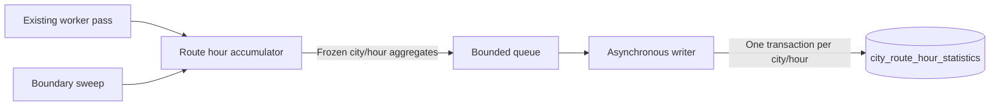

# Hourly Route History — Design Document

**Status:** Proposed; design only, implementation and deployment pending  
**Date:** 2026-10-10  
**Scope:** PostgreSQL history of worker observations by city, resolved route, and UTC hour

## Recommendation

Add one table, `public.city_route_hour_statistics`. Collect route observations during the existing worker pass, aggregate a complete UTC hour in memory, and send one immutable city/hour envelope to an asynchronous writer. Persist that envelope in one database transaction.

Start with hourly activity, processed-vehicle observations, movement, detected/published crossings, and crossing suppression counts. Store the numerators and denominators so period queries can calculate correct averages. Include configured routes with zero activity when their city feed is healthy.

This release has no route-minute table. Its completeness evidence comes from continuous worker capture and atomic persistence of the finalized hour. It cannot offer the existing category feature's independent reconciliation against 60 durable minute records. A crash can lose the current hour; disclose that as missing or partial history. Do not add a durable per-cycle log or a second aggregation service to recover it in v1.

## Questions this history answers

- Which routes have the most observed vehicles during an hour?
- Which routes generate the most published tone opportunities, and when?
- Why does a route have vehicles but few crossings: stale observations, first sightings, non-advancing positions, transfers, or teleports?
- How much accepted along-route movement does the worker observe for each route?
- How do these measurements change by day or local hour, with collection gaps visible?

Persisted history starts when the existing per-city database collection is enabled with dry run off. Existing city and category aggregates do not contain the route breakdown needed for backfill.

## Existing implementation and extension points

| Existing code | Relevant behavior |
| --- | --- |
| `TransitDataWorker/Worker.cs`, `BuildRouteIndex` | Builds city-scoped route geometry, category, cumulative-distance, and trigger-point maps. Both raw static IDs and resolved join keys can index the same route. |
| `Worker.ProcessSpatialReconciliationAsync` | Has vehicle identity, resolved route, snap position, source timestamp, crossing records, and suppression reason during the current vehicle loop. |
| `Worker.ExecuteAsync` | Knows final fetch/processing/publication outcomes and the city-cycle completion timestamp. This is the commit point for capture. |
| `Statistics/CityCategoryStatisticsCapture.cs` | Implements cycle deduplication and movement eligibility, including timestamp watermarks, transfers, geometry changes, and the 2,000-meter guard. |
| `Statistics/CategoryStatisticsAccumulator.cs` | Demonstrates exact hourly identity sets, UTC windows, boundary evidence, sweeps, and immutable finalization. |
| `WebAPI/Statistics/CategoryStatisticsWriter.cs` | Demonstrates nonblocking channel admission, bounded retry, and shutdown drain. Its independently committed row slices cannot be reused unchanged for atomic route-hour writes. |
| `Data/Statistics/CityCategoryStatisticsStore.cs` | Demonstrates immutable payload comparison and monotone conflict quarantine. Its durable-minute requirement does not apply to this new table. |

The deployed WebAPI already references both Worker and Data. Keep the same dependency direction: Worker owns capture and aggregate DTOs; WebAPI owns the writer/adapter; Data owns entities and persistence. Route history shares the per-city database collector's existing `HistoricalStatistics.Enabled`, `HistoricalStatistics.DryRun`, and resolved `HistoricalStatistics.Cities` settings. It does not depend on `CityCategoryInsights.Enabled`.

## Route identity and catalog

The grain is `(city_slug, route_join_key, hour_start_utc)`. Preserve route-key spelling and case using ordinal comparison. Canonicalize city slugs through existing city configuration. Never lowercase route keys using category normalization.

Use `RouteShapeProperties.JoinKey` for catalog membership and `nearest.RouteJoinKey` for resolved observations. Do not group directly by raw `Trip.RouteId`, and do not enumerate `_routeIndex.Keys` to discover routes: that dictionary contains raw-ID aliases which would duplicate rows and zero samples.

Build a separate immutable canonical catalog alongside the existing route indexes, within the same `RouteCatalogSnapshot` generation. Each entry has:

- `RouteJoinKey`, display `RouteShortName`, and the configured `Category`.
- The set of contributing static `RouteId` values. Populate a nullable `static_route_id` on the persisted row only when there is exactly one; it is metadata, not the history key.
- A deterministic `route_catalog_fingerprint` of the key, contributing IDs, category, and actual ordered geometry used by the worker. Use a documented SHA-256 encoding with ordinal ordering, UTF-8 strings, and unambiguous lengths/separators.

Several shapes or static IDs can resolve to the same worker route. V1 records that worker route as one unit; it does not promise separate statistics for static IDs, directions, or branches collapsed into that key. A reused public route key may also represent changed service over time. Preserve its fingerprint in history and disclose changes; do not claim a permanent transit-service identity.

A byte-identical catalog refresh does not invalidate route coverage or movement baselines. An actual membership, identity, category, or geometry change makes the open city/hour partial and resets affected movement baselines. V1 conservatively marks all rows in that city/hour partial. Its envelope contains the union of old and newly introduced routes, retains each entry's first metadata snapshot, and sets `catalog_changed=true`; an introduced or removed route never receives invented full-hour zeros. The next stable hour uses the new catalog.

Missing or unmatched input route keys remain city-level data-quality diagnostics. They do not create arbitrary new route rows or an invented `unknown` route. These statistics describe successfully joined routes, not the entire raw feed population.

## Measurements and semantics

All additive measurements are committed to `[hour_start_utc, hour_start_utc + 1 hour)` using the single city-cycle completion timestamp. Source timestamps establish movement freshness, not historical bucketing. A movement interval crossing an hour boundary belongs once to its completing cycle.

| Measurement | Stored values | Interpretation |
| --- | --- | --- |
| Activity | `active_vehicle_count_sum`, `valid_active_sample_count`, `peak_active_vehicle_count` | Sum, sample denominator, and peak of distinct positioned vehicles observed per eligible cycle. Stationary vehicles count. Healthy empty cycles contribute a zero sample for every configured route. |
| Hourly population | `distinct_active_vehicle_count` | Exact distinct eligible vehicle identities seen on that route during the hour. Identities remain in memory only. |
| Processing volume | `vehicle_observations_processed_count`, `stale_observations_count` | Additive worker processing observations, including stale observations. These are updates, not unique vehicles. Match the current city processing-count branches. |
| Movement | `distance_meters_sum`, `distance_interval_count`, `distance_rejected_count` | Accepted absolute change in along-route meters, accepted interval denominator including zero movement, and rejected representative observations. |
| Soundscape | `crossings_detected_count`, `crossings_published_count` | Actual records prepared by crossing detection versus those included in a batch whose publisher returns true. Neither is a count of notes heard by listeners. |
| Suppression | `crossings_suppressed_first_seen`, `crossings_suppressed_delta_leq_zero`, `crossings_suppressed_teleport`, `crossings_suppressed_transfer` | Counts of vehicle observations receiving each existing suppression reason; not an estimated number of lost notes. |

Activity deduplicates once per vehicle/city/cycle: the first eligible entity in feed order selects its resolved route, matching the category capture convention. Processing and crossing counts preserve actual worker record counts even when duplicate entities appear. A vehicle transferring between routes can appear in two route-hour distinct sets. Summing those sets' sizes is not an exact city-hour distinct population.

Movement uses the existing insights rules: valid finite position/geometry, strictly increasing per-vehicle source timestamp, same resolved route and geometry, absolute delta at most 2,000 meters, and rounding once to six decimal places. First sightings, missing/equal/older timestamps, transfers, invalid geometry, and excessive deltas contribute rejection diagnostics. Keep the watermark from moving backward; unknown freshness clears the movement baseline. A fresh transfer or excessive delta seeds a new baseline. Identical catalog refreshes do not reset it.

Commit activity and accepted movement only for an eligible city cycle. Keep processing/detection/suppression observations from partial work as diagnostics. Credit actual published crossings after a known successful publish even when another part of capture is partial; the hour remains partial. No publication attempt is a known zero only when successful processing produced no publishable batch. False or indeterminate publication is unavailable coverage, not a healthy zero.

Shared city fetch timing, feed health, total batch wire bytes, and process memory remain city/worker statistics. This release does not estimate their allocation to routes or measure route processing duration.

## Capture and finalization

1. Begin a route cycle against the same catalog snapshot as live processing, when route capture is enabled for the city. Keep feed-order activity deduplication and aggregate counters local to that cycle.
2. During the existing loop, record eligible activity, snap/movement observations, processed/stale observations, and crossing suppression reasons by resolved route. Count detected records by their `RouteJoinKey`.
3. After `PublishBatchAsync`, record successful crossing publication. Never queue recyclable live event lists.
4. At the outer city-cycle boundary, commit exactly once with fetch, processing, route readiness, publication, catalog-generation evidence, and completion time. Recheck catalog content against the initial snapshot to prevent a refresh during fetch/processing from producing definitive mixed-geometry statistics. A failed fetch or not-ready cycle still records failure evidence for the configured route cohort.
5. Maintain one current and at most one boundary-pending city/hour accumulator. Store exact per-route hourly identity sets and additive counters. Baselines/watermarks survive hour transitions and follow the existing 20-minute pruning horizon, with explicit caps below.
6. Seal the preceding hour only after a healthy successor observation supplies end-boundary evidence, or after its cadence deadline expires. The successor's counters belong to the new hour; only its timing/outcome proves the previous boundary.
7. Freeze all rows for that city/hour into one immutable envelope, validate it, and call `IRouteHourStatisticsSink.TryEnqueue`. Drop all hourly vehicle identities after sealing.

An independent `TimeProvider` sweep runs at most every 15 seconds so a hung feed does not prevent finalization. Sweep and cycle commit share a short lock; no fetch, publish, storage, channel wait, or logging I/O runs under it. A sweep can seal an expired hour as partial while a cycle is still in flight; that cycle belongs to its later completion hour and cannot reopen the sealed hour.

After a long pause, do not replay every missed hour into the queue. Record the bounded retained windows and let queries disclose intermediate missing hours. Shutdown flushes observed windows as partial, once, before writer admission closes. Configure hosted-service registration so the worker and capture sweep stop before the writer drains.

Route capture exceptions must not alter feed processing, crossings, or live publication. Catch instrumentation failure, mark the affected hour's capture evidence invalid, and emit a bounded safe summary. Keep the existing category path and its contract intact. Reuse its rules and fixtures; do not replace it with a generic multi-dimensional statistics framework in this feature.

## Hour coverage without durable minutes

An hour is `Complete` only if:

- Its canonical route cohort was available for the whole hour and did not change.
- Healthy predecessor and successor observations bracket the UTC boundaries, with gaps within the configured cadence limit.
- Every observed city cycle in the hour had eligible activity/processing and known publication coverage, including healthy empty cycles.
- The maximum gap between observations, including both boundary gaps, is within the cadence limit.
- Capture stayed enabled, the hourly population remained intact, and there was no instrumentation loss, clock regression, or exceeded memory limit.

Track these facts directly at hour level. Do not persist `covered_minutes=60`: no route-minute evidence exists. Persist `start_boundary_ok`, `end_boundary_ok`, sample counts, maximum gap, and bounded `incomplete_reasons` instead. Do not require exactly 360 samples for a ten-second worker: actual scheduling and city processing affect counts; observed continuity and eligible outcomes determine completeness.

Use a fixed reason vocabulary: `startup_fragment`, `shutdown_fragment`, `source_failure`, `route_index_unavailable`, `processing_failure`, `publication_unavailable`, `boundary_unproven`, `gap_exceeded`, `catalog_changed`, `clock_regression`, `capture_failure`, and `identity_limit_exceeded`. Freeze each reason set in ordinal order for stable payload equality; never store exception text as a reason. Apply identity caps while recording observations as well as while committing the hourly sets.

| Case | Capture status / effective query coverage |
| --- | --- |
| Healthy full hour, route has no positioned vehicles | `Complete`; activity, processed observations, and crossings are known zeros. Movement averages with zero denominators are null. |
| Failed/partial source, processing exception, unknown publish, excessive gap, startup/shutdown fragment, or changed catalog | `Partial` when useful eligible samples exist; retained counters are diagnostic. |
| Known catalog but no valid activity or publication samples | `NoData`; no definitive means or cadence. |
| Crash before finalization, rejected queue admission, exhausted writes, or entirely skipped window | Missing row; never synthesize a stored zero. |
| Conflicting finalized producer payload | Original capture status retained, `has_conflict=true`; effective coverage is `Conflict`. |

Startup cannot reconstruct a preceding observation. Its first hour is partial, even if startup happens close to the UTC boundary. A graceful restart does not merge two partial fragments into a complete hour. Avoid a fabricated hourly denominator when an identity cap was exceeded: set `distinct_active_vehicle_count=null`, flag the loss, and exclude definitive measures.

An observed gap bound is a capture claim, not a recoverable event ledger or proof of service availability. Atomic persistence preserves that claim as a unit; it does not improve a producer's incomplete observations.

## Database model

Add a focused EF entity/configuration and a schema-only migration. Use the existing database and migration bundle.

**Table:** `public.city_route_hour_statistics`  
**Primary key:** `(city_slug, route_join_key, hour_start_utc)`  
**Definition:** `observed-city-route-hour-statistics-v1`

| Group | Columns and types |
| --- | --- |
| Key | `city_slug varchar(64)`, `route_join_key text`, `hour_start_utc timestamptz` |
| Metadata | `route_short_name text NULL`, `static_route_id text NULL`, `category varchar(64)`, `route_catalog_fingerprint varchar(64)`, `catalog_changed boolean`, `definition_version varchar(64)` |
| Provenance | `capture_run_id uuid`, `persisted_at_utc timestamptz` |
| Coverage | `collection_status varchar(16)`, `has_conflict boolean`, `incomplete_reasons text[]`, `healthy_cadence_limit_seconds integer`, `observed_cycle_count bigint`, `valid_active_sample_count bigint`, `valid_publish_cycle_count bigint`, `failed_cycle_count bigint`, `first_cycle_utc timestamptz NULL`, `last_cycle_utc timestamptz NULL`, `max_observation_gap_seconds numeric(20,6) NULL`, `start_boundary_ok boolean`, `end_boundary_ok boolean` |
| Activity | `active_vehicle_count_sum bigint`, `peak_active_vehicle_count bigint`, `distinct_active_vehicle_count bigint NULL` |
| Processing | `vehicle_observations_processed_count bigint`, `stale_observations_count bigint` |
| Movement | `distance_meters_sum numeric(20,6)`, `distance_interval_count bigint`, `distance_rejected_count bigint` |
| Crossings | `crossings_detected_count bigint`, `crossings_published_count bigint`, the four suppression counts as `bigint` |

`capture_run_id` is generated once per capture process and reused in its frozen rows. It identifies producer provenance, not a transit vehicle or user. All counter defaults are zero; absent evidence remains nullable or explicitly incomplete. Never persist vehicle/trip/listener IDs or raw feed bodies.

Add one secondary index `(city_slug, hour_start_utc, route_join_key)` for all-route city/time queries; the primary key serves one-route time queries. Start without partitioning, materialized views, a route dimension table, or a public endpoint.

Enforce aligned UTC hour keys, nonnegative counters/distances, samples no greater than observed cycles, stale no greater than processed, published no greater than detected, known status/reason values, bounded nonblank IDs, and canonical microsecond timestamps. When present, first/last cycle times must be ordered and inside the keyed hour; an observation count of zero has neither timestamp. Require peak activity no greater than the activity-count sum and, when intact, hourly distinct population no smaller than peak activity. Use a 512 UTF-8 byte route-key validation limit for predictable indexed keys; an over-limit catalog entry invalidates capture for that city and reports the reason instead of truncating identity. Check actual catalog values during validation.

`Complete` requires positive observations, all active/publish samples eligible, zero failed cycles, both boundary flags, a known acceptable maximum gap, an intact distinct count, no catalog change, and no incomplete reasons. Conflicts are a separate monotone flag. `NoData` requires zero eligible samples, activity, accepted movement, and published crossings; processing/detection diagnostics may still be nonzero.

Definition version is a payload field, following the existing statistics pattern. An incompatible deployment crossing an hour cannot create a second competing definitive definition for the same key: the transition hour is partial/conflicted, and the next full stable hour uses the new version. Read queries separate versions and cadence policies.

## Atomic writer and conflict handling

Use a dedicated `RouteHourStatisticsWriter` and `CityRouteHourStatisticsStore`, following the current writer's lifecycle but with a whole-city/hour transaction boundary.

The envelope carries city, UTC hour, capture run ID, and an ordinally sorted immutable row set. It contains only aggregates and route metadata. Producer admission is synchronous `TryWrite` on a bounded channel with `FullMode.Wait`, a single reader, and synchronous continuations disabled. Acceptance means admitted to process memory, not persisted.

For each envelope:

1. Validate the entire payload and open a fresh context and transaction.
2. Acquire a transaction-scoped PostgreSQL advisory lock for this feature's `(city, UTC hour)` key before inspecting existing rows. Derive its signed 64-bit value from a stable namespaced SHA-256 encoding, never process-randomized `GetHashCode`. A hash collision only serializes unrelated writes. All writes to this table must use this store. Transaction-scoped advisory locks are released at transaction end; see [PostgreSQL's locking documentation](https://www.postgresql.org/docs/current/explicit-locking.html#ADVISORY-LOCKS).
3. If no rows exist for that city/hour, insert the entire envelope and commit. Parameterized inserts may be split into commands, but all commands share the same transaction.
4. If the existing route-key set and every immutable payload match, report `Unchanged`. Exclude database-generated `persisted_at_utc` and monotone `has_conflict` from immutable equality; include capture run ID, definitions, and fingerprints. Keep existing conflict flags set on an identical retry.
5. If any payload or route-key set differs, set `has_conflict=true` on all existing rows in that city/hour, preserve all counters, and commit quarantine. Do not insert missing incoming routes, overwrite a partial hour, or add together producer fragments. Emit the incoming/existing aggregate row counts and a bounded reason.

The city/hour lock covers empty-key races and changed catalogs without a separate manifest table. The atomic row set doubles as the stored catalog cohort for that window. Use read-committed transactions with the lookup after acquiring the advisory lock so a waiting writer sees the preceding committed envelope. All writers and future maintenance must honor this protocol; read queries use a single snapshot.

Bound retries to three whole-transaction attempts with one- and two-second delays on recognized transient failures. Each attempt uses exactly the same frozen rows. A commit whose acknowledgement was lost is safely resolved by an identical retry. Bound lock waits, command duration, and the total attempt duration; cancellation/failed commands roll back the entire attempt. The current writer's per-slice commits must not be copied here.

No collector rereads Grafana for these data. No database/channel await occurs on the worker path. Queue rejection or exhausted writes loses the whole envelope and creates an explicit history gap. Emit safe summaries for inserted, unchanged, quarantined, dropped, retried, and shutdown-undrained envelopes. Logs supplement diagnosis; missing-row queries remain necessary.

## Configuration and resource bounds

Reuse the per-city database collection controls already bound through `HistoricalStatisticsOptions`:

- `HistoricalStatistics.Enabled=false`: skip route capture, its sweep, and its writer.
- `HistoricalStatistics.Enabled=true`: capture hourly route observations for the same resolved `HistoricalStatistics.Cities` list as the city-minute collector. Reuse the host's existing fallback to all configured cities when that list is empty.
- `HistoricalStatistics.DryRun=true`: capture and validate finalized envelopes, then report bounded aggregate summaries without database writes. Dry-run observations do not become retained route history.
- `HistoricalStatistics.DryRun=false`: persist finalized envelopes through the atomic writer.

The global `Enabled` setting takes precedence over `DryRun`; a disabled collector performs neither dry-run capture nor persistence.

Reuse the existing `enableHistoricalStatistics` and `historicalStatisticsDryRun` deployment parameters and their environment bindings. Add no route-specific enable switch, city exclusion list, or one-city pilot requirement. Deployments use their existing collection settings and city scope.

The WebAPI maps its validated options into the route capture's runtime selection so Worker does not reference WebAPI-owned `HistoricalStatisticsOptions`. Preserve the existing collector's source credentials, collection interval, overlap, and ingestion-grace behavior; they do not control route-hour bucketing, which comes directly from the worker. Validate enabled capture has the required database registration as the existing host already does; standalone Worker must reject persistence without a real sink.

Keep route resource tunables in `HistoricalStatistics:RouteHours`, bound to `RouteHourHistoryOptions` with no `Enabled`, `DryRun`, `Cities`, or `DisabledCities` properties. This subsection adjusts capture/writer limits, not whether or where history is collected.

| Setting | Proposed starting value |
| --- | --- |
| `MaxObservationGapSeconds` and city overrides | 30 seconds, greater than worker interval and at most 60; validate against observed worker cadence |
| `QueueCapacity` | 16 city/hour envelopes |
| `MaxRoutesPerCityHour` | 4,096, including a changed catalog's union |
| `MaxTrackedVehiclesPerCity` | 25,000 movement baselines/watermarks |
| `MaxVehicleRouteMembershipsPerCityHour` | 50,000 distinct-set memberships across routes |
| `MaxRowsPerCommand` | 128; command chunking within one transaction |
| `CommandTimeoutSeconds` / `WriteAttemptTimeoutSeconds` | 5 / 30; total attempt timeout includes lock wait and all commands |
| `MaxWriteAttempts` / `ShutdownDrainSeconds` | 3 / 15 |

These are planning bounds, not measured production requirements. Validate positive finite ranges and cap oversized configuration. A route or identity cap must never evict silently and later claim a complete hour. On exceedance, mark the city/hour partial, invalidate its distinct denominator, and stop additional route capture for that hour. Continue live processing. If a route-union cap prevents constructing an honest envelope, drop it with a reason; do not silently omit routes. Resume at the next window only when within bounds, reseeding movement as needed.

For `R` canonical configured routes retained across all enabled cities, full healthy capture produces approximately `24R` rows/day and `8,760R` rows/year:

| Total routes | Rows/day | Rows/year |
| ---: | ---: | ---: |
| 100 | 2,400 | 876,000 |
| 1,000 | 24,000 | 8,760,000 |
| 3,000 | 72,000 | 26,280,000 |

Hourly storage has one-sixtieth the row count of the same routes at minute resolution. Include inactive routes so healthy zeros are distinguishable from missing capture. Measure actual row/index bytes, write latency, queue occupancy, distinct-set memory, and database growth during validation and normal collection; row counts alone are not a storage estimate.

Retain hourly history without an automatic deletion job in v1. The rollout owner should set a retention horizon after measuring growth. A future retention policy must remove complete city/hour envelopes under the same write lock rather than individual route rows, and queries must disclose the retained starting range.

## Query contract

Initial access is documented parameterized read-only SQL. Inputs are city, one or more route join keys or all routes retained in a range, supported definition, ordered UTC range, and optional configured IANA time zone. Historical route labels must be selectable even after removal from the current catalog.

| Derived measure | Calculation for complete nonconflicting hours |
| --- | --- |
| Average observed active vehicles | `sum(active_vehicle_count_sum) / nullif(sum(valid_active_sample_count), 0)` |
| Peak observed vehicles | `max(peak_active_vehicle_count)` |
| Processed observations | `sum(vehicle_observations_processed_count)` |
| Stale observation fraction | `sum(stale_observations_count) / nullif(sum(vehicle_observations_processed_count), 0)` |
| Accepted movement | `sum(distance_meters_sum)` |
| Meters per observed route-vehicle-hour | `sum(distance_meters_sum) / nullif(sum(distinct_active_vehicle_count), 0)` |
| Meters per accepted vehicle update | `sum(distance_meters_sum) / nullif(sum(distance_interval_count), 0)` |
| Published opportunities per observed hour | `sum(crossings_published_count) / nullif(complete_hour_count, 0)` |

Convert to numeric before division. Never average displayed hourly averages, sum hourly distinct counts and label them unique vehicles for the whole period, extrapolate partial hours, or interpret estimated movement as completed-trip distance. Per-route distinct denominators count route-vehicle-hours; they cannot produce a city unique-vehicle denominator by summing routes.

Every query response includes stored status, effective conflict/missing coverage, requested/contributing hour counts, UTC bounds, definition, cadence policy, fingerprints/catalog-change diagnostics, units, and relevant numerators/denominators. Partial rows can be inspected separately with clear diagnostic labels. Definitive period measures use fully contained complete nonconflicting UTC hours only, grouped by compatible definition and cadence policy. Return null means and zero contributing-hour count when no complete hours exist.

Generate the requested UTC hour grid for explicitly selected route keys and left-join stored rows. A missing pair is `Missing`, not zero. For all-route range queries, discover route keys from retained rows in that range; the cohort for a successfully persisted city/hour is its atomic row set. Do not use today's catalog to assert which routes existed in an entirely missing historical hour. Explicitly requested keys remain queryable when no rows exist. Missing historical membership is unknown in v1, not proof that service or a route was absent.

For individual local-hour results, preserve UTC key, local date/hour, and offset. Typical-local-hour averages divide summed crossings by complete contributing UTC hours; a repeated DST hour can contribute twice, while a skipped local hour has no invented row. Never prorate an hourly aggregate when the request cuts through its boundary. Report earliest retained route-hour capture, without implying continuous history from that date.

## Implementation sequence

1. Add the entity, mapping, indexes/checks, and schema-only migration; review the generated bundle.
2. Add the canonical catalog snapshot and fingerprint without changing live route joins or aliases.
3. Implement `RouteHourHistoryOptions`, `RouteHourStatisticsCapture`, the hour accumulator, frozen DTO/sink, and sweep lifecycle in Worker. Wire observation hooks into the existing pass and completion boundary.
4. Implement the atomic store and writer in Data/WebAPI. Register writer before capture/worker, with a disabled no-op sink, a dry-run validation sink, and enabled database validation. Bind the existing `HistoricalStatistics` controls and city selection; add only the route resource tunables beneath that section.
5. Add hourly, period, local-hour, and coverage SQL recipes and documentation. No public endpoint is required for capture or internal analysis.
6. Complete correctness/resource checks and deploy schema before code. Route history follows the deployment's existing per-city collection enablement, dry-run setting, and city scope.

Suggested additions follow existing directories and naming: `Data/Models/CityRouteHourStatistic.cs`, `Data/Configurations/CityRouteHourStatisticConfiguration.cs`, `Data/Statistics/CityRouteHourStatisticsStore.cs`, Worker `Statistics/RouteHour*`, and WebAPI `Statistics/RouteHourStatisticsWriter.cs`. Keep Shared and frontend changes out of the capture feature.

## Verification and rollout criteria

Use the existing xUnit projects and deterministic clock/feed/publisher fixtures. Meaningful checks include:

- Raw ID and short-name aliases produce one canonical row; city scopes, key case, grouped shapes, and changed mappings preserve correct identity.
- Duplicate vehicle entities follow activity deduplication while processing and actual crossing counts match worker semantics. A transfer counts in both hourly route populations but creates no cross-route movement.
- Stationary, reverse, first-seen, missing/equal/older timestamps, synthetic source repeats, geometry change, and the exact 2,000-meter limit follow movement rules.
- Sum of route detected/suppression/processed observations reconciles to the corresponding city cycle; successful route publications reconcile to the successful batch. These compare actual capture observations, not sums of city-minute snapshot gauges.
- Healthy empty hours create complete zeros; failures do not. Exact UTC boundaries, healthy predecessor/successor evidence, startup, shutdown, sweep during an in-flight cycle, clock regression, long pauses, and cap exceedance never create false completeness.
- Real disposable PostgreSQL tests prove whole-envelope rollback on an insert failure, concurrent identical retries, different producers/catalogs/versions, lost commit acknowledgement, sticky quarantine, and no fragment merging. Never delete a user's database for tests.
- Read-only recipes preserve missing/partial/conflicted hours, weighted means, historical routes, empty ranges, request-boundary context, and DST identity.
- Verify the existing `HistoricalStatistics.Enabled`, `DryRun`, and resolved `Cities` controls govern both city-minute and route-hour history: disabled capture does no route work, dry run performs no route writes, and enabled persistence covers the same selected cities. Enabled capture performs no live database/channel wait and does not change existing city/category history, metrics, or wire output. Run relevant existing regression tests after the hooks change.

Validation measures canonical route/key cardinality and checks all resource settings for the existing selected cities. Quality targets: no false-complete failure cases, route/city reconciliation passing, no queue drops or conflicts under healthy single-replica operation, at least 99% complete eligible route-hours over 24 hours after startup fragments, and at most 5% matched-load p95 worker-cycle increase. These are targets to validate, not results already achieved, and do not impose a separate city-by-city rollout gate.

A restart near an hour boundary can sacrifice an hour rather than recover it. If that loss proves unacceptable in operation, the next design should evaluate durable checkpoints and ownership; it should not silently relax hourly coverage or merge fragment counts without exact distinct-population recovery.

## References

- [Current city/category implementation plan](../specs/056-city-transit-type-insights/plan.md)
- [Observed city/category statistics contract](../specs/056-city-transit-type-insights/contracts/observed-category-statistics-v1.md)
- [Original city/category insights design](CITY_TRANSIT_TYPE_INSIGHTS_DESIGN_DOCUMENT.md)
- [Route shape identity](../src/ChefKnifeStudios.TransitJazz.Shared/GtfsData/RouteShapeFeature.cs)
- [Worker](../src/Server/ChefKnifeStudios.TransitJazz.Server.TransitDataWorker/Worker.cs)
- [PostgreSQL advisory locking](https://www.postgresql.org/docs/current/explicit-locking.html#ADVISORY-LOCKS)
