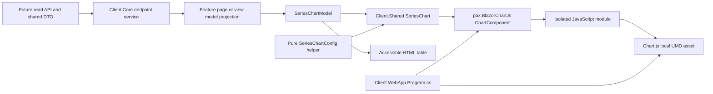

# Design Document: Chart Components with `pax.BlazorChartJs`

**Status:** Proposed  
**Date:** 2026-10-04

## Purpose

Define how TransitJazz can add reusable Chart.js views to its existing Blazor
WebAssembly client using the `pax.BlazorChartJs` package. The package supplies
the C# configuration models and Blazor component that bridge to Chart.js. The
application remains responsible for its data contracts, chart meaning, page
layout, accessible descriptions, and dependency version policy.

This document describes the client-side chart foundation. It does not add a
chart page, a server endpoint, or a new data collection feature. In particular,
the current City and Transit Type Insights plan defines SQL as its analyst
interface and explicitly has no public endpoint or client UI. A chart for that
data requires a separate read API and feature scope.

## Current codebase fit

- `Client.Shared` is a .NET 10 Razor class library containing reusable Razor
  components, app services, and JavaScript assets. It already references
  MatBlazor and `Microsoft.AspNetCore.Components.Web` 10.0.0.
- `Client.WebApp` is the .NET 10 Blazor WebAssembly host. Its `Program.cs`
  configures dependency injection, and its `wwwroot/index.html` owns host-level
  scripts and static files.
- Shared components already lazy-load ES modules from
  `Client.Shared/wwwroot/js` through Blazor JS interop. `pax.BlazorChartJs`
  uses JavaScript isolation for its own interop module, so it does not need a
  global chart interop script in `index.html`.
- Package versions are currently specified in project files. No
  `Directory.Packages.props` or client `package.json` is present.
- The app already uses `ColorConstants` and a light/dark theme. Chart canvas
  colors must be set as Chart.js options; CSS alone cannot style pixels drawn
  on the canvas.

## Design decision

Use one app-owned `SeriesChart` component for ordinary numeric series charts.
Give it a small presentation model, and keep the package-specific mapping in
one static helper. Features supply data and meaning; this shared rendering
path supplies layout, states, colors, accessible tables, and chart updates.
Line and grouped bar charts share this path because both consume a label list
and aligned numeric series. Implement the chart kind required by the first
feature, then add the other kind when a feature needs it.

Add `pax.BlazorChartJs` to `Client.Shared`. Keep wire contracts in the existing
`ChefKnifeStudios.TransitJazz.Shared` project when shared with the server,
following the current endpoint-service convention. `Client.Core` owns typed
API consumption. The feature's page or view model projects those contracts
into presentation data; `Client.Shared/Components/Charts` alone translates
that data into package types. The WebAssembly host chooses runtime assets.

The abstraction is deliberately bounded: one X label sequence, one numeric Y
axis, one unit per chart, and several comparable series. This is a reusable
display contract, not a second model of Chart.js. A scatter plot, mixed chart,
or dual-axis view needs a separate concrete design when requested.



### Architectural decisions

| Concern | Decision | Reason |
| --- | --- | --- |
| Reuse boundary | Share the numeric-series display contract and renderer | New metrics and cities usually change data, not rendering behavior |
| Composition | Keep the heading, status, canvas host, and table in `SeriesChart` initially | A separate card component would add indirection with one consumer |
| Mapping | Use plain static functions for datasets and options | Mapping needs no DI, interface, factory, or mutable service |
| Feature logic | Project DTOs in the owning page or existing view model | Fetching, filtering, coverage, and metric definitions stay with the feature |
| State | Accept one load-state enum; derive empty from data | Avoid contradictory loading/error/empty booleans |
| Ownership | Keep one mutable `ChartJsConfig` per mounted package component | Prevent subscription mismatches and interference between charts |
| Styling | Resolve palette and keyed series styles in the shared mapper | One theme or style change reaches every ordinary chart |
| Extension | Add a narrow capability only for an approved chart requirement | Keep pages independent of arbitrary Chart.js options |

DRY applies to repeated knowledge: the definition of a metric belongs to the
data feature; the definition of a chart style belongs to the presentation
helper. A few lines of feature-specific projection are reasonable. Extract
them only when multiple consumers share the same meaning. Do not introduce a
generic `Chart<T>`, base-component hierarchy, chart registry, provider
interface, or builder pipeline to eliminate incidental syntax.

## Package and runtime asset setup

The package page currently lists `pax.BlazorChartJs` 0.9.1 as targeting
`net10.0`, with a dependency on `Microsoft.AspNetCore.Components.Web` version
10.0.9 or newer. The client currently has direct 10.0.0 references. Before
adding the package, align the relevant Blazor package references to a matching
.NET 10 servicing patch at or above the package minimum, then confirm restore
does not report a package downgrade. Recheck the package's target framework and
minimum dependency when implementation begins, since the package is still
below 1.0 and can change its API. These requirements were checked against
[NuGet 0.9.1](https://www.nuget.org/packages/pax.BlazorChartJs/0.9.1)
on the document date.

Add the package reference to
`src/Client/ChefKnifeStudios.TransitJazz.Client.Shared/ChefKnifeStudios.TransitJazz.Client.Shared.csproj`,
where its components will be authored. Keep Chart.js types and dependencies
out of `Client.Core` so API consumers do not acquire a presentation-library
dependency.

Register the package once in
`src/Client/ChefKnifeStudios.TransitJazz.Client.WebApp/Program.cs`:

```csharp
using pax.BlazorChartJs;

builder.Services.AddChartJs(options =>
{
    options.ChartJsLocation =
        $"{builder.HostEnvironment.BaseAddress}vendor/chartjs/4.5.1/chart.umd.min.js";
});
```

The package's sample configuration defaults to a CDN URL. For predictable
runtime behavior, place a pinned Chart.js UMD distribution and its license in
the WebAssembly host's static assets, for example:

```text
src/Client/ChefKnifeStudios.TransitJazz.Client.WebApp/wwwroot/
└── vendor/chartjs/4.5.1/
    ├── chart.umd.min.js
    └── LICENSE.md
```

This avoids a runtime request to a CDN and avoids introducing an npm build
pipeline solely for one JavaScript file. Record the upstream version and source
beside the file. Resolve the URL against the host base address so deployment
under a subpath also works. Upgrade the package and asset deliberately, then
verify the combination against the wrapper's compatibility notes. The
[package setup source](https://github.com/ipax77/pax.BlazorChartJs/blob/v0.9.1/src/pax.BlazorChartJs/ServiceCollectionExtensions.cs)
defines asset URLs and optional defaults; the wrapper loads its isolated
module without a global interop script in `index.html`.

Keep `AddChartJs` responsible for bootstrap configuration. Put theme-dependent
and chart-dependent options in `SeriesChartConfig`. App-wide `Defaults` are
available, but dividing the same styling policy between global defaults and
per-chart options would make precedence harder to follow. Use one explicit
per-chart policy for the initial implementation.

Do not configure optional plugin URLs at installation time. Add a plugin asset
and its version only when a specific chart needs it. The package documents
support for `chartjs-plugin-datalabels`, ArbitraryLines, and custom plugins;
each plugin adds its own code and compatibility surface.

## Component placement and responsibilities

Proposed client structure; create feature/API files only when that scope is
approved:

```text
src/
├── ChefKnifeStudios.TransitJazz.Shared/   # wire DTOs for a future read API
└── Client/
    ├── ChefKnifeStudios.TransitJazz.Client.Core/
    │   └── Services/EndpointsServices/   # typed API consumption
    ├── ChefKnifeStudios.TransitJazz.Client.Shared/
    │   ├── Components/Charts/
    │   │   ├── SeriesChart.razor         # markup, state, theme, update coordination
    │   │   ├── SeriesChart.razor.css     # one responsive layout policy
    │   │   ├── SeriesChartModel.cs       # display records and small enums
    │   │   └── SeriesChartConfig.cs      # pure validation/dataset/options mapping
    │   ├── ViewModels/                  # feature-owned DTO projection, when needed
    │   └── Constants/ColorConstants.cs  # existing palette; reuse it
    └── ChefKnifeStudios.TransitJazz.Client.WebApp/
        ├── Program.cs                   # AddChartJs and local asset location
        └── wwwroot/vendor/chartjs/       # pinned distribution, license, source note
```

`SeriesChart` is a presentational component. It has no endpoint service,
polling timer, city lookup, statistical calculation, or feature filter. Its
only injected app dependencies are the existing settings and event services
for the theme. It renders a single heading, period/coverage description,
status, canvas host, summary, and data table.

`SeriesChartConfig` contains ordinary functions such as `Validate(model)`,
`BuildDatasets(model, kind, isDark)`, and `BuildOptions(model, kind, isDark)`.
Those functions use package models directly and perform no I/O or interop.
Return fresh option/dataset objects on each mapping; never share mutable
package objects between chart instances. Keep palette/style resolution in
private helper methods in this file until its size warrants a separate file.

Keep a feature's DTO-to-model projection in its existing page/view-model file
at first. Extract a named mapping file if that logic becomes substantial or
reused. A `CategoryHourLineChart` that only forwards parameters to `SeriesChart`
adds no behavior and should not be created. Extract `TransitChartCard` only
when another renderer also needs the same shell.

The data flow is one-way:

1. The page or view model selects the city, date range, and metric.
2. A `Client.Core` API service fetches the selected typed response DTO.
3. The feature projects one display snapshot with labels, series, and text.
4. `SeriesChart` uses that snapshot for both the chart and HTML table, and
   maps it to `ChartJsConfig` through the shared helper.
5. `pax.BlazorChartJs` owns browser chart creation, update, resize, and disposal.

Never return `ChartJsConfig` from the API or place `pax` types in shared API
contracts. The server contract should express domain data and definitions; the
browser component should choose how to draw it.

### Narrow display contract

The following illustrates the app-owned types, not a package API or a new
server response schema:

```csharp
public enum ChartLoadState { Loading, Ready, Error }
public enum SeriesChartKind { Line } // Add Bar with the first grouped-bar feature.

public sealed record ChartSeries(
    string Key,
    string Label,
    IReadOnlyList<double?> Values);

public sealed record SeriesChartModel(
    string XAxisTitle,
    string YAxisTitle,
    IReadOnlyList<string> Labels,
    IReadOnlyList<ChartSeries> Series);
```

`SeriesChart` accepts `Model`, `Kind`, `State`, `Title`, `Summary`, optional
`PeriodLabel` and `CoverageDescription`, and an optional safe `ErrorMessage`.
`YAxisTitle` includes the unit; all series must use that unit. Page-specific
controls stay outside the component. Initially use these fixed parameters
rather than multiple render-fragment slots or arbitrary option overrides.

The caller publishes a new model reference when plotted data or axis metadata
changes. Copy/materialize DTO sequences at projection time and treat published
collections as immutable. Records and `IReadOnlyList` alone do not freeze an
underlying list. The component can use reference changes to avoid repeated
mapping on unrelated parent renders; it does not need deep equality, hashes,
revision counters, or a data cache.

Validate once for each new model before sending anything to JavaScript:

- Series keys are nonempty and unique within the chart. They identify meaning,
  such as `bus` or `rail`, and remain stable across refreshes and reordering.
  Map them directly to dataset `Id`; display labels may be localized.
- Every value sequence has exactly the label count. Preserve the caller's
  order; do not independently sort each series or truncate a mismatch.
- Values are finite numbers or `null`. `0` is an observed zero; `null` is an
  unavailable value. Reject NaN/infinity and malformed input with a safe
  visible error and diagnostic logging.
- Axis titles, series labels, and the required ready-state summary identify
  the displayed measure. Formatting and localization are presentation work;
  calculations and collection-status interpretation belong to the feature.

For example, labels `["00:00", "01:00", "02:00"]` and bus values
`[12, null, 0]` must produce a missing middle point and an observed final zero
in both the canvas and table. The table displays `Unavailable` for the null;
it must not show a zero or omit the row.

### Deterministic state handling

| Input | Rendered behavior |
| --- | --- |
| `Loading` | Heading and loading status; do not mount the canvas |
| `Error` | Heading and safe error message; retry controls remain with the page |
| `Ready` with a null model, no labels, no series, or no numeric values | Empty message and coverage description; retain a table when there are labeled unavailable values |
| `Ready` with valid numeric values, including all zeros | Chart, summary, coverage description, and table |
| Invalid model | Visible data-format error; do not send a partial/misaligned dataset |

Evaluate the model only in `Ready`; a null model is empty. Derive other empty
cases from the validated snapshot. Coverage is independent of load
state: a successfully loaded response can have partial coverage. Changing to
loading, error, or empty removes the child chart and lets the package dispose
it. A later ready state mounts a fresh child. This intentionally simple policy
does not preserve a stale canvas while refreshing; add that UX only if needed.

The owning page handles cancellation and out-of-order responses when filters
change. A canceled or older request must not replace the current selection's
snapshot. Publish the model, summary, period, and coverage from the same
selected response in one render, then set `State` to `Ready`. The chart
receives the selected result and never manages requests.

## Chart configuration and updates

Use typed package models. Keep package types and mutable configuration private
to the rendering layer; pages never hold a `ChartComponent` reference or call
its update methods. Initialize a populated `ChartJsConfig` before rendering
the child, then retain that same instance for its entire mounted lifetime.

```razor
<ChartComponent @key="_config.ChartJsConfigGuid"
                ChartJsConfig="_config"
                OnEventTriggered="HandleChartEvent" />
```

This is a correctness requirement for 0.9.1: the
[component source](https://github.com/ipax77/pax.BlazorChartJs/blob/v0.9.1/src/pax.BlazorChartJs/ChartComponent.razor.cs)
subscribes to configuration events in `OnInitialized` and initializes the
browser chart after its first render. Replacing the config parameter on an
already mounted component would not rebind those subscriptions.

Stage changed data/theme in Blazor parameter/event handling, then issue updates
after rendering and after receiving `ChartJsInitEvent`. Retain only the latest
pending snapshot during initialization and apply it once the child is ready;
there is no need for an update queue, lock, custom resize observer, or second
interop service. Handle initialization events only for the current config ID
so an event from a removed child cannot update its replacement.

| Change | Update policy |
| --- | --- |
| First ready render | Create one populated config and let the child initialize |
| New values, labels, series order, additions, or removals | One `SetDatasetsSmooth` call with stable IDs and labels |
| Theme or axis metadata, with or without new data | Rebuild options and dataset styling; include options in the same synchronization call |
| Unrelated parent render or changed summary text | Update HTML only; no interop |
| Chart kind changes | Mount a fresh child/config, keyed by the new config identity |
| Navigation or removal | Unsubscribe app theme handler; package disposes its own chart |

Use one synchronization path for initial and refreshed dataset styling. The
following is the update call shape once the existing chart is initialized;
the helper names are proposed app code:

```csharp
_config.Options = SeriesChartConfig.BuildOptions(model, kind, isDark);
_config.SetDatasetsSmooth(
    datasets: SeriesChartConfig.BuildDatasets(model, kind, isDark),
    labels: model.Labels.ToList(),
    updateOptions: true,
    updateAnimation: "none");
```

The [0.9.1 dataset source](https://github.com/ipax77/pax.BlazorChartJs/blob/v0.9.1/src/pax.BlazorChartJs/ChartJsConfig/ChartJsConfig.Datasets.cs)
supports this batched labels/datasets/options update. The helper is event-based
and returns `void`; do not describe it as an awaited completion acknowledgment.
The wrapper coordinates app inputs while the package performs browser work.
Use no update animation initially, which also avoids introducing motion for
routine refreshes. Browser verification must cover rapid data/theme changes;
a custom synchronization mechanism requires evidence of an actual failure.

Keep `ReinitializeChart` for a proven package-specific structural requirement.
Routine values, colors, label changes, and resizes do not need full chart
recreation. A deliberate chart-kind change gets a new child so its lifecycle
and subscriptions remain straightforward.

The package supports a named JavaScript callback registry through
`ChartJsFunction`. Use it only for options that need executable
JavaScript, such as custom tooltip or tick formatting. Keep those callbacks in
a small app-owned module under `Client.Shared/wwwroot/js` and configure the
module location from `Program.cs`. Do not serialize JavaScript source strings
or put callback implementation in API DTOs. Ordinary line and bar charts need
no callback module.

The package also supports binary dataset payloads for large Y and XY series.
Hourly aggregates for a bounded display period are small, so the initial
design uses normal typed datasets and JSON interop. Adopt binary updates only
after browser profiling identifies serialization as a cost.

## Transit data and presentation rules

Chart.js renders the values it receives; it does not enforce TransitJazz
statistical definitions. Any insights endpoint and DTO must preserve the
metric's unit, denominator, time zone, and collection status. For the current
category insights proposal, a chart must:

- distinguish missing or incomplete hours from healthy zero values;
- use only verified complete hours for definitive averages, while showing
  coverage status alongside the requested period;
- preserve denominator-weighted calculations across periods rather than
  averaging already-averaged values;
- label distance and cadence units clearly and identify the displayed time
  zone;
- expose only aggregate data to the browser, consistent with the insights
  design's rule against persisting vehicle, route, or trip identifiers.

The feature projection builds a common expected-hour grid for every series,
orders it by UTC hour, and inserts `null` for unavailable or unverified hours.
It formats local-hour labels with dates and UTC offsets where needed to
distinguish repeated daylight-saving hours. Use a category X axis for this
regular grid, so spacing represents one UTC hour even across local clock
changes. Arbitrarily spaced observations do not fit this display contract.
Chart.js time axes would add a date library and adapter; defer those until a
chart requires proportional spacing for irregular timestamps.
[Chart.js time-axis requirements](https://www.chartjs.org/docs/latest/axes/cartesian/time.html)
describe that additional dependency.

The shared mapper sets line `SpanGaps = false` and `Tension = 0`: missing
observations remain visible gaps and adjacent known observations use straight
segments. Grouped bars use the same null/zero distinction and a zero baseline.
For the initial nonnegative transit measures, lines also use a zero baseline;
signed measures require an explicit scale-policy decision rather than silent
clipping. Keep rounding in display formatting, not in the plotted numeric
values. [Chart.js line options](https://www.chartjs.org/docs/latest/charts/line.html#line-styling)
define gap and interpolation behavior.

Metric definitions and denominator-weighted period results remain authoritative
in the server/query contract. The projection aligns, selects, converts agreed
units, and formats those results; `SeriesChartConfig` does not recompute them.
Do not create a client-side metric registry that repeats SQL formulas.

Suggested first visual, if the feature later adds a UI, is a line chart of one
hourly metric across time, with separate datasets for a small set of transit
categories. A grouped bar chart is appropriate for comparing categories over a
short fixed period. The SQL-backed feature plan currently has no API or page;
adding those is a separate design and implementation decision.

## Theme, layout, and accessibility

Resolve text, grid, border, and tooltip colors from `ColorConstants.Light`
and `ColorConstants.Dark` in `SeriesChartConfig`. Series colors and line/point
styles also come from that one helper. Use a small mapping by semantic series
key and a deterministic fallback for new keys; styling must not depend on a
series' current array index or localized label. Keep labels and the table
available even when fallback styles repeat. Check contrast in both themes.

`SeriesChart` reads the initial theme from
`ISettingsService.GetSettings().IsDarkModeEnabled`, subscribes to the existing
`IEventNotificationService.EventReceived`, and handles `ThemeChangedEventArgs`.
Marshal the state change through `InvokeAsync`, stage it for the shared update
path, and unsubscribe in `Dispose`. Reuse the existing app notification
pattern; no chart-specific theme service or page-level theme handlers are
needed. A theme update changes both options and datasets, since updating axis
colors alone leaves series and point colors stale.

Keep one default size in scoped CSS:

```css
.series-chart__host {
    position: relative;
    width: 100%;
    min-width: 0;
    height: clamp(16rem, 40vh, 24rem);
}
```

The mapper sets `Responsive = true` and `MaintainAspectRatio = false`. The
host contains only the package component's canvas; headings, statuses, and
tables sit outside it. This follows
[Chart.js responsive-container requirements](https://www.chartjs.org/docs/latest/configuration/responsive.html).
Do not manually set canvas dimensions or add a resize interop layer. A future
layout can override the host height through a CSS custom property when there
is a concrete need, without adding another component type.

Use a labeled `<figure>` with a visible heading, summary, and coverage text.
Put the visual canvas host under `aria-hidden="true"` and supply a semantic
HTML table outside that host as the complete accessible data equivalent.
The 0.9.1 component renders its own canvas without an unmatched-attribute
parameter; this approach works without modifying the package or adding
JavaScript solely to attach canvas attributes. It addresses the canvas
limitation described in
[Chart.js accessibility guidance](https://www.chartjs.org/docs/latest/general/accessibility.html).

Generate the table from the same `SeriesChartModel` used for datasets: labels
become row headers, series labels become column headers, and nullable values
become numbers or the localized `Unavailable` label. Include a caption with
the unit and period, and use `scope` on headers. A native `<details>` section
may contain the table to save space; its `<summary>` must be keyboard
accessible. The summary text describes the measure, period, and coverage,
while the table provides every plotted value.

Initial charts are read-only views. If a future feature adds dataset toggles
or point selection, provide keyboard-accessible HTML controls outside the
hidden canvas host. Loading and error messages use appropriate status/alert
semantics; do not put the entire updating table in a live region. If the
Chart.js asset fails to load, the ready-state text and table still render.
The [0.9.1 component](https://github.com/ipax77/pax.BlazorChartJs/blob/v0.9.1/src/pax.BlazorChartJs/ChartComponent.razor.cs)
does not expose a general initialization-failure event, so do not promise that
a catch around a config helper reports every browser failure.

## Reuse and extension rules

A feature using the ordinary renderer supplies only app-owned parameters:

```razor
<SeriesChart Model="_distanceChart"
             Kind="SeriesChartKind.Line"
             State="_loadState"
             Title="Average observed distance"
             Summary="@_summary"
             PeriodLabel="@_periodLabel"
             CoverageDescription="@_coverageDescription" />
```

Another metric changes the feature projection, Y-axis title, and explanatory
text. Another city changes the query selection and time-zone labels. Neither
requires new canvas markup, colors, state handling, table logic, or package
configuration. Grouped bar rendering adds one dataset-mapping branch while
retaining the model, shell, options policy, and update path.

| New requirement | Smallest extension |
| --- | --- |
| Same metric in several features | Reuse the proven feature projection as a named pure function |
| Consistent precision across charts | Add one explicit formatting policy used by table/text; add a callback only if canvas formatting requires it |
| Another renderer needs the same heading/status/table layout | Extract the existing shell through composition at that point |
| Scatter, mixed units, stacking, or dual axes | Design a concrete component/contract around that meaning; reuse only the policies it actually shares |
| Large streaming datasets | Profile a bounded display window first; adopt binary updates or decimation only for measured costs |

Avoid adding a `ChartJsOptions` parameter, `Action<ChartJsConfig>` escape hatch,
or dictionary of arbitrary options. Those would let each page recreate the
duplicated policy this design removes. The package's own models remain the
extension mechanism inside the presentation layer.

## Version and dependency policy

- Pin an exact `pax.BlazorChartJs` version in the project file, following the
  repository's current direct-version package-reference convention.
- Pin the Chart.js asset independently. The wrapper's release compatibility
  table reports Chart.js 4.x and testing against 4.5.1; keep the deployed asset
  on a tested version.
- Keep `pax` usage within `Client.Shared/Components/Charts`. This confines any
  future wrapper migration to the presentation layer. The host's `AddChartJs`
  bootstrap registration and focused mapping tests are the explicit exceptions;
  feature pages and public display parameters contain no package types.
- Review release notes before upgrades. Version 0.9 introduced changes to
  callback and scriptable-option models, so do not float the NuGet version.
- Add no Chart.js plugins until a concrete chart requirement justifies each
  additional package or asset.
- Track the Chart.js MIT license with the locally served distribution.

This design still depends on two external projects: `pax.BlazorChartJs` for
the Blazor component and Chart.js for rendering. Self-hosting Chart.js removes
the runtime CDN dependency; it does not remove the need to review and pin both
upstream versions.

## Implementation sequence

1. Reconfirm the package's latest stable version, .NET target, minimum
   `Microsoft.AspNetCore.Components.Web` dependency, Chart.js compatibility,
   and license.
2. Align the client ASP.NET Core/Blazor package patch versions and add the
   package reference to `Client.Shared`.
3. Add the pinned local Chart.js distribution and configure `AddChartJs` in the
   WebAssembly host. Confirm there are no runtime CDN requests for Chart.js.
4. Add the small display records and shared mapping helper. Build `SeriesChart`
   for the first required chart kind, including its table, state handling,
   scoped CSS, and existing theme-event integration.
5. Exercise the component in a minimal host view with a fixed representative
   snapshot before introducing API concerns. Wire the feature's existing
   page/view model to the same contract once data acquisition is scoped.
6. Run the focused mapping checks and browser scenarios below. Add the second
   chart kind only when a feature needs it, reusing the same rendering path.
7. If the first use is City and Transit Type Insights, separately design the
   read API and shared response DTO before connecting the insights page. The
   current SQL-only plan remains unchanged by this foundation proposal.

### Validation and acceptance

Use the existing `Client.Shared.Tests` xUnit project for pure mapping and
feature-projection behavior. Add focused cases for null versus zero,
length/finite-value validation, stable IDs/styles after reordering, and an
expected hourly grid that retains missing and repeated local hours. These
protect app-owned meaning; do not duplicate the package's serialization tests
or introduce a new test framework just for this foundation.

Browser checks must demonstrate:

- Initial render and multiple charts on one view, with independent configs
  and no runtime Chart.js CDN requests.
- Data refresh plus series add/remove/reorder, retaining the same mounted
  canvas/config for ordinary updates.
- Model/theme changes before initialization and rapid changes after it; the
  final chart and table reflect the newest selected snapshot.
- A theme change updates axes, tooltip, series, and points; narrow layouts
  resize without blur, growth loops, or overflow.
- Loading, error, unavailable-only data, all-zero data, navigation away, and
  remounting behave as specified, with no late app event handlers.
- A blocked Chart.js asset still leaves meaningful text and the data table;
  table access and any controls work with a keyboard and screen reader.

Build/publish the WebAssembly host to check package compatibility and static
asset resolution. Reference changes, config ownership, and the null/zero
contract are required even if only one chart ships initially.

No package installation or client code change is part of this design document.

## References

- [`pax.BlazorChartJs` repository and README](https://github.com/ipax77/pax.BlazorChartJs)
- [`pax.BlazorChartJs` 0.9.1 on NuGet](https://www.nuget.org/packages/pax.BlazorChartJs/0.9.1)
- [Chart.js documentation](https://www.chartjs.org/docs/latest/)
- [Chart.js accessibility](https://www.chartjs.org/docs/latest/general/accessibility.html)
- [Chart.js responsive layout](https://www.chartjs.org/docs/latest/configuration/responsive.html)
- [Chart.js line gaps and interpolation](https://www.chartjs.org/docs/latest/charts/line.html#line-styling)
- [Chart.js time-axis dependencies](https://www.chartjs.org/docs/latest/axes/cartesian/time.html)
- [`pax` 0.9.1 component lifecycle](https://github.com/ipax77/pax.BlazorChartJs/blob/v0.9.1/src/pax.BlazorChartJs/ChartComponent.razor.cs)
- [`pax` 0.9.1 dataset synchronization](https://github.com/ipax77/pax.BlazorChartJs/blob/v0.9.1/src/pax.BlazorChartJs/ChartJsConfig/ChartJsConfig.Datasets.cs)
- [TransitJazz City and Transit Type Insights design](CITY_TRANSIT_TYPE_INSIGHTS_DESIGN_DOCUMENT.md)
- [Client.Shared project](../src/Client/ChefKnifeStudios.TransitJazz.Client.Shared/ChefKnifeStudios.TransitJazz.Client.Shared.csproj)
- [Client.WebApp project](../src/Client/ChefKnifeStudios.TransitJazz.Client.WebApp/ChefKnifeStudios.TransitJazz.Client.WebApp.csproj)
