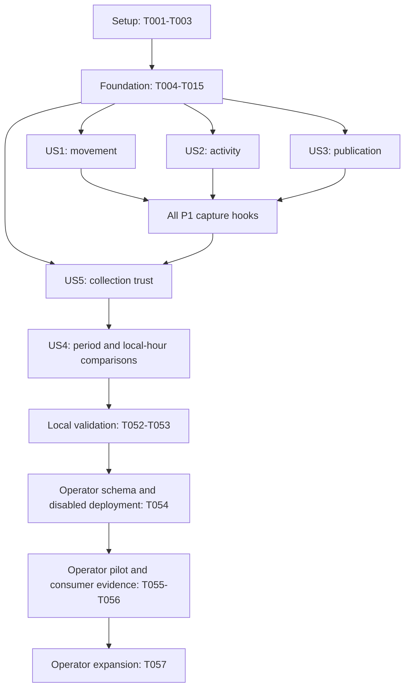

# Tasks: City and Transit Type Insights

**Input**: Design documents from `specs/056-city-transit-type-insights/`  
**Prerequisites**: [plan.md](plan.md), [spec.md](spec.md), [research.md](research.md), [data-model.md](data-model.md), [contracts](contracts/observed-category-statistics-v1.md), [quickstart.md](quickstart.md)  
**Branch**: `056-city-transit-type-insights`

**Tests**: Included because the source design explicitly calls for unit and PostgreSQL integration validation, and the specification defines deterministic acceptance cases. Test authoring precedes the related implementation; run the relevant checks before marking each story complete. Tasks were generated before implementation; the completion checkboxes below track implementation and validation evidence from the follow-up run.

**Organization**: Shared prerequisites first; story phases follow P1 order US1, US2, US3, US5, then P2 US4. Original story numbers remain unchanged. Shared source files are edited sequentially across stories. Each story can be exercised with its own fixture observations; live availability requires all P1 capture and trust behavior.

## Format: `[ID] [P?] [Story] Description`

- Every task starts with a checkbox and sequential ID.
- `[P]` identifies separate-file work that can run concurrently once its stated prerequisites are complete.
- Story phases use `[US1]` through `[US5]`; setup, foundation, and final work have no story label.
- All paths below are relative to the repository root. Retain the existing projects and runtime dependencies.
- Operator release tasks T054–T057 record evidence through the existing release process. Complete local implementation with capture disabled before executing those release steps.
- Never create commits or invoke commit hooks; preserve the repository's AGENTS.md instruction.

## Phase 1: Setup (Shared Infrastructure)

**Purpose**: Prepare existing projects, test fixtures, and disabled defaults without creating a new service or package.

- [X] T001 Prepare an opt-in disposable PostgreSQL fixture and bound-SQL loading in `src/Server/ChefKnifeStudios.TransitJazz.Server.WebAPI.Tests/Statistics/CategoryStatisticsDatabaseFixture.cs` and `src/Server/ChefKnifeStudios.TransitJazz.Server.WebAPI.Tests/ChefKnifeStudios.TransitJazz.Server.WebAPI.Tests.csproj`; copy `specs/056-city-transit-type-insights/contracts/*.sql` as test content, require explicit disposable database configuration, and never delete an operator database or count skipped integration tests as proof.
- [X] T002 [P] Add validated disabled-by-default capture settings in `src/Server/ChefKnifeStudios.TransitJazz.Server.TransitDataWorker/Statistics/CityCategoryInsightsOptions.cs`: global enablement with optional city exclusions, 30-second gap default and city overrides, 256-envelope queue, 128-row batch limit, five-second command timeout, three total attempts, and 15-second drain; validate finite bounds and cycle interval < gap limit <=60.
- [X] T003 [P] Add `TimeZoneId` to `src/Server/ChefKnifeStudios.TransitJazz.Server.TransitDataWorker/Cities/CityConfig.cs` and the existing city entries in `src/Server/ChefKnifeStudios.TransitJazz.Server.TransitDataWorker/appsettings.json` and `src/Server/ChefKnifeStudios.TransitJazz.Server.WebAPI/appsettings.json`; configure America/New_York for the five Eastern US cities, America/Toronto for Toronto, and America/Denver for Denver, retaining existing configuration and secret bindings.

**Checkpoint**: Existing project layout and test facilities support the feature; configuration is ready for independent enablement.

---

## Phase 2: Foundational (Blocking Prerequisites)

**Purpose**: Establish common aggregate types, persistence, and capture seams. All story phases depend on this phase.

- [X] T004 Define immutable minute/hour aggregate DTOs, worker coverage enum, transient cycle facts, and `bool TryEnqueue(FinalizedCategoryStatisticsBatch)` in `src/Server/ChefKnifeStudios.TransitJazz.Server.TransitDataWorker/Statistics/FinalizedCategoryStatisticsBatch.cs`; define the separate three-status Data enum in `src/Server/ChefKnifeStudios.TransitJazz.Server.Data/Models/CategoryCollectionStatus.cs`; freeze definition version `observed-city-category-statistics-v1`, canonicalize UTC microseconds/decimal precision, and keep identities out of finalized DTOs.
- [X] T005 [P] Implement the minute entity and explicit mapping in `src/Server/ChefKnifeStudios.TransitJazz.Server.Data/Models/CityCategoryMinuteStatistic.cs` and `src/Server/ChefKnifeStudios.TransitJazz.Server.Data/Configurations/CityCategoryMinuteStatisticConfiguration.cs`; include every data-model field, city/category/minute composite key, nonnegative checks, UTC alignment, three statuses, stored cadence limit, and monotone conflict flag without BaseEntity/audit columns.
- [X] T006 [P] Implement the hour entity and explicit mapping in `src/Server/ChefKnifeStudios.TransitJazz.Server.Data/Models/CityCategoryHourStatistic.cs` and `src/Server/ChefKnifeStudios.TransitJazz.Server.Data/Configurations/CityCategoryHourStatisticConfiguration.cs`; include the city/category/hour composite key, additive fields, nullable exact distinct count, covered minutes 0..60, and completeness constraints without foreign keys or extra indexes.
- [X] T007 Register both DbSets in `src/Server/ChefKnifeStudios.TransitJazz.Server.Data/AppDbContext.cs` and update the model-wide entity-count assertion in `src/Server/ChefKnifeStudios.TransitJazz.Server.WebAPI.Tests/Statistics/CityMinuteStatisticModelTests.cs` to exactly three statistics entities while preserving every existing city-only mapping/source assertion.
- [X] T008 [P] Add entity validation and mapping checks in `src/Server/ChefKnifeStudios.TransitJazz.Server.WebAPI.Tests/Statistics/CityCategoryStatisticModelTests.cs` for composite keys, explicit SQL types, normalized labels, six-decimal canonicalization, UTC microseconds/alignment, zero-versus-unavailable semantics, status/sample consistency, and absence of persisted identities/audit fields.
- [X] T009 [P] Implement the focused transactional store and bounded write report in `src/Server/ChefKnifeStudios.TransitJazz.Server.Data/Statistics/CityCategoryStatisticsStore.cs`; normalize/deduplicate incoming keys, insert with parameterized unique-key conflict protection, lock/read and compare immutable payloads, preserve differing counters with monotone quarantine, propagate minute conflicts to existing hours, and accept Complete hours only after all 60 durable compatible minute rows reconcile.
- [X] T010 Generate the schema-only `CreateCityCategoryStatistics` migration in `src/Server/ChefKnifeStudios.TransitJazz.Server.Data/Migrations/` and update `src/Server/ChefKnifeStudios.TransitJazz.Server.Data/Migrations/AppDbContextModelSnapshot.cs`; inspect the generated change for exactly the two new tables/keys/checks, with no feed queries, seeds, old-table changes, or automatic retention deletion.
- [X] T011 [P] Introduce the enabled-city capture facade and no-op path in `src/Server/ChefKnifeStudios.TransitJazz.Server.TransitDataWorker/Statistics/CityCategoryStatisticsCapture.cs` and the optional capture dependency/city-cycle begin/commit/failure seams in `src/Server/ChefKnifeStudios.TransitJazz.Server.TransitDataWorker/Worker.cs`; expose transient observation hooks, retain unavailable measure flags until observations establish them, and isolate capture exceptions from live processing.
- [X] T012 Implement shared minute/hour counter containers and explicit fixture-driven finalization in `src/Server/ChefKnifeStudios.TransitJazz.Server.TransitDataWorker/Statistics/CategoryStatisticsAccumulator.cs`; use half-open UTC windows, checked sums, frozen precision, observation timing/version/policy evidence, short memory-only synchronization, and aggregate-only output. Automated boundary/loss lifecycle behavior is completed in US5.
- [X] T013 [P] Add real PostgreSQL immutable-store and migration checks in `src/Server/ChefKnifeStudios.TransitJazz.Server.WebAPI.Tests/Statistics/CityCategoryStatisticsStoreTests.cs` and `src/Server/ChefKnifeStudios.TransitJazz.Server.WebAPI.Tests/Statistics/CityCategoryStatisticsMigrationTests.cs`; cover new/identical/differing/concurrent deliveries, duplicate batch keys, quarantined retries, parent-hour quarantine, all additive comparisons, and omitted unverifiable Complete candidates.
- [X] T014 [P] Add deterministic TimeProvider, feed, publisher, and aggregate-sink fixtures in `src/Server/ChefKnifeStudios.TransitJazz.Server.TransitDataWorker.Tests/Statistics/CategoryStatisticsCaptureFixture.cs`; reuse project conventions and built-in facilities without another runtime package, and support independently seeded complete cycle/hour observations.
- [ ] T015 Build the affected projects and run the foundational model/store/migration checks through `src/Server/ChefKnifeStudios.TransitJazz.Server.WebAPI.Tests/ChefKnifeStudios.TransitJazz.Server.WebAPI.Tests.csproj`; inspect the EF migration script/bundle using `src/Server/ChefKnifeStudios.TransitJazz.Server.Data/Dockerfile` and record schema-only/key/concurrency evidence in `specs/056-city-transit-type-insights/quickstart.md`.

**Checkpoint**: Common types and persistence are usable, capture seams remain disabled, and fixture observations can independently exercise each metric. A stored Complete label alone is never sufficient for query availability.

---

## Phase 3: User Story 1 — Understand Hourly Observed Movement (Priority: P1)

**Goal**: Produce total accepted distance, exact observed vehicle-hour distance, and the per-update diagnostic without changing live movement/crossing behavior.

**Independent Test**: Seed a complete hour with 1,200 meters, three distinct active vehicles, and two accepted intervals; obtain 400 meters/vehicle-hour and 600 meters/update. Include a stationary vehicle without an accepted interval, reverse movement, source repeats, transfers, and invalid geometry.

### Tests for User Story 1

- [X] T016 [P] [US1] Add movement eligibility and transient-baseline checks in `src/Server/ChefKnifeStudios.TransitJazz.Server.TransitDataWorker.Tests/Statistics/CategoryMovementTests.cs` for first sightings, fresh stationary/reverse/pivot intervals, exactly 2,000 meters versus greater jumps, equal/older/missing timestamps, interpolation repeats, transfers, invalid geometry, geometry refresh, and reseeding without watermark reversal.
- [X] T017 [P] [US1] Add database/query examples in `src/Server/ChefKnifeStudios.TransitJazz.Server.WebAPI.Tests/Statistics/CategoryMovementQueryTests.cs` for exact whole-hour uniqueness, stationary/no-accepted-movement denominator contributions, 1,200/3 and 1,200/2 results, zero denominators, all additive reconciliation, and missing/conflicting backing-minute exclusion.

### Implementation for User Story 1

- [X] T018 [P] [US1] Implement the dedicated transient movement baseline in `src/Server/ChefKnifeStudios.TransitJazz.Server.TransitDataWorker/Statistics/CityCategoryStatisticsCapture.cs`; require strictly increasing per-vehicle timestamps and stable resolved route/geometry generation, accept absolute finite deltas <=2,000 meters including zero, round once before both sums, and clear/reseed rejected baselines according to research without substituting merged timestamps or poll time.
- [X] T019 [P] [US1] Implement exact per-city/category/hour population sets in `src/Server/ChefKnifeStudios.TransitJazz.Server.TransitDataWorker/Statistics/CategoryStatisticsAccumulator.cs`; count each eligible vehicle once per category/hour across cycles, retain stationary/no-accepted-movement members, handle category transfers, expose a lost-population denominator as unavailable, and discard identities after finalization.
- [X] T020 [US1] Wire movement and eligible-population observations into `src/Server/ChefKnifeStudios.TransitJazz.Server.TransitDataWorker/Worker.cs` after the existing snap and before state replacement, reusing cumulative meters; add geometry-generation invalidation and movement-state pruning at the existing 20-minute horizon while preserving live snap, stale, crossing, metric, and wire behavior.
- [X] T021 [P] [US1] Validate and align the complete-hour movement projection with final mappings in `specs/056-city-transit-type-insights/contracts/hourly-insights.sql` and `specs/056-city-transit-type-insights/contracts/observed-category-statistics-v1.md`; return accepted distance, exact hourly distinct count, interval/rejection counts, cadence policy, null-safe means, and all durable-minute verification conditions.
- [X] T022 [US1] Run the movement/baseline/query checks in `src/Server/ChefKnifeStudios.TransitJazz.Server.TransitDataWorker.Tests/Statistics/CategoryMovementTests.cs` and `src/Server/ChefKnifeStudios.TransitJazz.Server.WebAPI.Tests/Statistics/CategoryMovementQueryTests.cs`; record reference calculations and the unchanged live-behavior evidence in `specs/056-city-transit-type-insights/quickstart.md`.

**Checkpoint**: US1 is demonstrable using complete fixture hours. Live capture remains disabled until the remaining P1 sampling, publication, and collection trust work is complete.

---

## Phase 4: User Story 2 — Understand Average Observed Activity (Priority: P1)

**Goal**: Count joined vehicles once per city cycle and expose the sample-weighted mean, including valid zeros.

**Independent Test**: Three eligible cycles with counts 2, 0, and 4 produce two mean vehicles and three valid samples. Duplicate IDs in different categories still contribute once; failed collection does not become zero.

### Tests for User Story 2

- [X] T023 [P] [US2] Add activity eligibility checks in `src/Server/ChefKnifeStudios.TransitJazz.Server.TransitDataWorker.Tests/Statistics/CategoryActivityTests.cs` for finite/in-range positions, successful joins before snapping, first-eligible-entity selection across duplicate categories, stationary vehicles, missing/empty route indexes, dynamic lowercase categories, unknown activation, successful empty feeds, and mixed-source failure.
- [X] T024 [P] [US2] Add sample-weighted activity query checks in `src/Server/ChefKnifeStudios.TransitJazz.Server.WebAPI.Tests/Statistics/CategoryActivityQueryTests.cs` for 2/0/4 samples, unequal sample counts, covered zero versus missing/NoData, exposed denominators, and independence from browser selections/audio settings.

### Implementation for User Story 2

- [X] T025 [US2] Complete cycle activity collection in `src/Server/ChefKnifeStudios.TransitJazz.Server.TransitDataWorker/Worker.cs` and `src/Server/ChefKnifeStudios.TransitJazz.Server.TransitDataWorker/Statistics/CityCategoryStatisticsCapture.cs`; count first eligible joined identities once across all categories before snapping, include stationary members, update activity sums/sample counts, create healthy configured-category zeros, and withhold eligible activity samples on invalid feed/route processing.
- [X] T026 [US2] Add the bound activity query recipe in `specs/056-city-transit-type-insights/contracts/activity-insights.sql` and document it in `specs/056-city-transit-type-insights/contracts/observed-category-statistics-v1.md`; reuse verified complete-hour evidence, divide summed active counts by valid samples, expose covered periods/denominators, and mask unavailable means.
- [X] T027 [US2] Run the activity checks in `src/Server/ChefKnifeStudios.TransitJazz.Server.TransitDataWorker.Tests/Statistics/CategoryActivityTests.cs` and `src/Server/ChefKnifeStudios.TransitJazz.Server.WebAPI.Tests/Statistics/CategoryActivityQueryTests.cs`; document why distinct joined activity can differ from old snapped-record city metrics in `specs/056-city-transit-type-insights/quickstart.md`.

**Checkpoint**: Activity is independently verifiable from eligible samples and its query recipe; no viewer state enters collection.

---

## Phase 5: User Story 3 — Compare Published Tone Opportunities (Priority: P1)

**Goal**: Attribute actual successful city-batch crossing records to categories and make failed/unknown cadence unavailable.

**Independent Test**: A complete hour with successful batches containing 40 bus and 15 rail records returns 40 and 15 opportunities; false/exception publication produces incomplete coverage, and a valid no-record cycle yields known zero.

### Tests for User Story 3

- [X] T028 [P] [US3] Add publication/crossing checks in `src/Server/ChefKnifeStudios.TransitJazz.Server.TransitDataWorker.Tests/Statistics/CategoryPublicationTests.cs` for true/false/exception/indeterminate outcomes, no-record processing, empty successful feed, representative activity deduplication versus all actual crossing records, transient list disposal, category reconciliation, and preservation of prepared city TonesEmitted semantics.
- [X] T029 [P] [US3] Add cadence query/definition checks in `src/Server/ChefKnifeStudios.TransitJazz.Server.WebAPI.Tests/Statistics/CategoryCadenceQueryTests.cs` for 40/15 category totals, complete zero, failed publication exclusions, unavailable versus zero, metadata, and independence from client mute/playback counts.

### Implementation for User Story 3

- [X] T030 [US3] Capture actual crossing counts and publication outcomes in `src/Server/ChefKnifeStudios.TransitJazz.Server.TransitDataWorker/Worker.cs` and `src/Server/ChefKnifeStudios.TransitJazz.Server.TransitDataWorker/Statistics/CityCategoryStatisticsCapture.cs`; classify every published record by resolved route category, credit only after PublishBatchAsync returns true, preserve failure evidence through exception paths, and establish valid zero only when processing proves it.
- [X] T031 [US3] Add the bound hourly cadence recipe in `specs/056-city-transit-type-insights/contracts/cadence-insights.sql` and its definitions in `specs/056-city-transit-type-insights/contracts/observed-category-statistics-v1.md`; reuse verified-hour evidence and report published opportunities, complete-hour coverage, and exclusions without claiming audible notes.
- [X] T032 [US3] Run the publication/cadence checks in `src/Server/ChefKnifeStudios.TransitJazz.Server.TransitDataWorker.Tests/Statistics/CategoryPublicationTests.cs` and `src/Server/ChefKnifeStudios.TransitJazz.Server.WebAPI.Tests/Statistics/CategoryCadenceQueryTests.cs`; record exact category-to-successful-city-batch reconciliation in `specs/056-city-transit-type-insights/quickstart.md`.

**Checkpoint**: All three metric collectors and their individual query recipes are testable. Live query availability still requires US5's window, writer, and durable coverage behavior.

---

## Phase 6: User Story 5 — Collect Trustworthy History While Transit Stays Live (Priority: P1)

**Goal**: Finalize trustworthy windows, persist without delaying live cycles, expose loss/conflicts, and support controlled enablement.

**Independent Test**: Drive healthy, empty, failed, delayed, restart, overflow, and conflicting observations through a deterministic clock and writer. Complete hours have exactly 60 durable compatible minute keys, while gaps/conflicts cannot produce definitive hourly measures.

### Tests for User Story 5

- [X] T033 [P] [US5] Add writer/admission/lifecycle checks in `src/Server/ChefKnifeStudios.TransitJazz.Server.WebAPI.Tests/Statistics/CategoryStatisticsWriterTests.cs` for disabled operation, aggregate-only snapshots, nonblocking full-channel rejection, FIFO minute-before-hour ordering, bounded batch/retry/timeout/drain settings, status mapping, loss reports, and independent database enablement.
- [X] T034 [P] [US5] Add deterministic coverage-window checks in `src/Server/ChefKnifeStudios.TransitJazz.Server.TransitDataWorker.Tests/Statistics/CategoryCoverageTests.cs` for exact UTC boundaries, predecessor/successor gaps, deadline expiration, startup/restart/shutdown fragments, clock reversal, route/policy changes, all three statuses, intact/lost distinct populations, and unknown activation with earlier omitted cycles even in minute zero.
- [X] T035 [P] [US5] Add real PostgreSQL durability checks in `src/Server/ChefKnifeStudios.TransitJazz.Server.WebAPI.Tests/Statistics/CategoryStatisticsDurabilityTests.cs` for missing/exhausted minute writes, bounded retry of Complete candidates, omitted unverifiable hours, later minute quarantine, definition/policy mismatch, overlap writers, exact additive equality, and snapshot-consistent query exclusion.

### Implementation for User Story 5

- [X] T036 [US5] Implement the aggregate sink/background writer in `src/Server/ChefKnifeStudios.TransitJazz.Server.WebAPI/Statistics/CategoryStatisticsWriter.cs`; use bounded Channel Wait mode with producer-only TryWrite, one reader, multiple writers, no synchronous continuations, explicit worker-to-Data status mapping, fresh contexts/transactions, finite transient attempts/timeouts, deterministic row splitting, and bounded shutdown drain.
- [X] T037 [US5] Complete automatic minute/hour finalization in `src/Server/ChefKnifeStudios.TransitJazz.Server.TransitDataWorker/Statistics/CategoryStatisticsAccumulator.cs`; add TimeProvider-driven successor/deadline closure, boundary gap proof, failed-cycle counting once, Partial/NoData rules, observed-hour unknown activation without invented earlier samples, at most current/pending hour populations, and all 60-minute/additive prerequisites.
- [X] T038 [US5] Complete lifecycle and capture-loss handling in `src/Server/ChefKnifeStudios.TransitJazz.Server.TransitDataWorker/Statistics/CityCategoryStatisticsCapture.cs` and `src/Server/ChefKnifeStudios.TransitJazz.Server.TransitDataWorker/Worker.cs`; wire the lightweight sweep, generation checks, startup/shutdown fragments, clock/capture failures, route/catalog refresh, and false queue admission into incomplete evidence without feed/publish/database I/O under accumulator locks.
- [X] T039 [US5] Register independent capture options, validated enabled-city zones, no-op/real sink, and writer-before-worker lifetime in `src/Server/ChefKnifeStudios.TransitJazz.Server.WebAPI/Program.cs`; add disabled standalone behavior and rejection of enabled capture without a real sink in `src/Server/ChefKnifeStudios.TransitJazz.Server.TransitDataWorker/Program.cs`; require the existing TransitJazzDB binding for capture without enabling the Grafana collector.
- [X] T040 [US5] Add bounded safe insertion/unchanged/conflict/backing-minute-unavailable/drop summaries in `src/Server/ChefKnifeStudios.TransitJazz.Server.WebAPI/Statistics/CategoryStatisticsWriter.cs` and capture-loss summaries in `src/Server/ChefKnifeStudios.TransitJazz.Server.TransitDataWorker/Statistics/CityCategoryStatisticsCapture.cs`; test that reports/logs carry only allowed aggregate fields and never credentials, raw feeds, or individual transit/listener IDs.
- [X] T041 [US5] Wire disabled-by-default CityCategoryInsights settings and global enablement/city-exclusion/policy controls in `src/Server/ChefKnifeStudios.TransitJazz.Server.WebAPI/appsettings.json`, `src/Server/ChefKnifeStudios.TransitJazz.Server.TransitDataWorker/appsettings.json`, `bicep/main.bicep`, and `bicep/modules/containerApp.bicep`; reuse the existing database secret binding and preserve independent HistoricalStatistics settings and single-replica deployment.
- [X] T042 [US5] Regenerate `bicep/main.json` from Bicep and extend disabled-default/schema-only validation in `.github/workflows/server.yml`; preserve the existing Data migration image and server-dev schema-first release gate, without automatic capture enablement or migrations that query transit history.
- [X] T043 [US5] Add a bound requested-window coverage recipe in `specs/056-city-transit-type-insights/contracts/minute-coverage.sql` and document it in `specs/056-city-transit-type-insights/contracts/observed-category-statistics-v1.md`; generate missing minute/hour keys, expose Partial/NoData/conflict/reconciliation reasons and durable covered-minute counts, mask unavailable values, and return the earliest retained category observation without reconstructing city-only history.
- [X] T044 [US5] Run writer/coverage/durability and unchanged worker metric/wire checks through `src/Server/ChefKnifeStudios.TransitJazz.Server.WebAPI.Tests/ChefKnifeStudios.TransitJazz.Server.WebAPI.Tests.csproj` and `src/Server/ChefKnifeStudios.TransitJazz.Server.TransitDataWorker.Tests/ChefKnifeStudios.TransitJazz.Server.TransitDataWorker.Tests.csproj`; update `specs/056-city-transit-type-insights/quickstart.md` with exact new configuration, migration identity, bounded-loss evidence, and remaining operator release gates.

**Checkpoint**: All P1 implementation can collect and return internally verified observations. Deployment/pilot evidence in the final phase remains necessary before general enablement or publishing queries.

---

## Phase 7: User Story 4 — Compare Periods and Local Hours Honestly (Priority: P2)

**Goal**: Provide weighted period and typical-local-hour results with exclusions, boundaries, named zones, and version/policy separation.

**Independent Test**: Hours with 1,200/3 and 1,800/2 yield 600 meters/vehicle-hour; 50 and 70 crossings across two complete local-hour observations yield 60 opportunities/hour. Incomplete hours are excluded and disclosed; repeated local hours retain distinct UTC identities and offsets.

### Tests for User Story 4

- [X] T045 [P] [US4] Add weighted-period checks in `src/Server/ChefKnifeStudios.TransitJazz.Server.WebAPI.Tests/Statistics/CategoryPeriodQueryTests.cs` for summed hourly distinct populations, unequal activity/interval denominators, unavailable zero denominators, no complete hours, full UTC-hour containment, and separate definition/cadence-policy groups.
- [X] T046 [P] [US4] Add local-hour/time-zone checks in `src/Server/ChefKnifeStudios.TransitJazz.Server.WebAPI.Tests/Statistics/CategoryLocalHourQueryTests.cs` for named-zone conversion, local date/offset/UTC identity, both DST directions, repeated-hour contributions, skipped-hour absence, contributing hour/day counts, and 120/2 cadence.
- [X] T047 [P] [US4] Add requested-range coverage checks in `src/Server/ChefKnifeStudios.TransitJazz.Server.WebAPI.Tests/Statistics/CategoryCoverageQueryTests.cs` for missing versus observed zero, Partial/NoData/quarantine reasons, partial first/last minutes with actual bounds and no prorating, excluded partial hours, unknown first activation, and pre-collection history.

### Implementation for User Story 4

- [X] T048 [US4] Add a bound period-summary recipe in `specs/056-city-transit-type-insights/contracts/period-insights.sql`; reuse authoritative verified-hour selection, sum all metric numerators and correct denominators, group compatible version/cadence policies, include complete-hour counts and actual contributing bounds, and pair it with requested-range coverage.
- [X] T049 [US4] Add a bound named-zone recipe in `specs/056-city-transit-type-insights/contracts/local-hour-cadence.sql`; retain UTC/local date/hour/offset for individual observations and calculate typical cadence from summed crossings divided by complete UTC-hour count, grouped by city/category/version/cadence policy/local hour without synthesizing skipped observations.
- [X] T050 [US4] Complete the analyst result-envelope and query recipes in `specs/056-city-transit-type-insights/contracts/observed-category-statistics-v1.md`; specify the required range/unit/definition/numerator/denominator/coverage/first-collectible metadata, partial-minute context, all exclusion reasons, historical labels, incompatible-version handling, and how the parameterized SQL outputs are read together without adding a public API.
- [X] T051 [US4] Run period/local-hour/coverage query checks in `src/Server/ChefKnifeStudios.TransitJazz.Server.WebAPI.Tests/Statistics/CategoryPeriodQueryTests.cs`, `src/Server/ChefKnifeStudios.TransitJazz.Server.WebAPI.Tests/Statistics/CategoryLocalHourQueryTests.cs`, and `src/Server/ChefKnifeStudios.TransitJazz.Server.WebAPI.Tests/Statistics/CategoryCoverageQueryTests.cs`; update the reproducible reference examples in `specs/056-city-transit-type-insights/quickstart.md`.

**Checkpoint**: Period and local-hour comparisons preserve each metric's denominator and explicitly account for unavailable coverage.

---

## Phase 8: Polish & Cross-Cutting Concerns

**Purpose**: Finish local verification and record the release/consumer evidence required by the specification. Operator steps follow the existing authorized deployment process.

- [ ] T052 Build `src/ChefKnifeStudios.TransitJazz.sln`, run the required affected worker/WebAPI checks, validate Bicep compilation and the existing migration-image build from `src/Server/ChefKnifeStudios.TransitJazz.Server.Data/Dockerfile`, and inspect the final migration script and query plans; record remaining failures or successful evidence in `specs/056-city-transit-type-insights/quickstart.md` without changing old metric/wire/source contracts.
- [ ] T053 Measure matched-load capture-disabled versus enabled p95 live-cycle duration and simulated storage-outage behavior using the completed fixture facilities in `src/Server/ChefKnifeStudios.TransitJazz.Server.TransitDataWorker.Tests/Statistics/CategoryStatisticsCaptureFixture.cs` and `src/Server/ChefKnifeStudios.TransitJazz.Server.WebAPI.Tests/Statistics/CategoryStatisticsWriterTests.cs`; record <=5% overhead, nonblocking behavior, actual memory/category cardinality, and bounded-loss results in `specs/056-city-transit-type-insights/quickstart.md`.
- [ ] T054 Operator: apply and verify the reviewed schema-only migration using `src/Server/ChefKnifeStudios.TransitJazz.Server.Data/Dockerfile` and the existing database-allowed deployment process, then deploy capture-disabled code through `.github/workflows/server.yml`; record database/migration/image identity and the schema-first gate evidence in `specs/056-city-transit-type-insights/quickstart.md`.
- [ ] T055 Operator: enable one city after checking per-vehicle timestamp interpretation and calibrating its stored cadence limit; observe 24 healthy hours after startup, reconcile category activity/crossings and 60-minute hourly totals, require >=99% complete minutes and <=5% matched-load p95 overhead, explain every gap/conflict, and record actual first retained capture dates in `specs/056-city-transit-type-insights/quickstart.md`.
- [ ] T056 Operator: record the definition-interpretation review of five representative analysts against `specs/056-city-transit-type-insights/contracts/observed-category-statistics-v1.md`; require at least four to distinguish observed vehicle-hour from completed-trip distance and published opportunities from audible notes, and retain the result in `specs/056-city-transit-type-insights/quickstart.md`.
- [ ] T057 Operator: remove city exclusions to expand capture and publish the validated internal query runbook only after T055–T056 pass, using `bicep/modules/containerApp.bicep` and `specs/056-city-transit-type-insights/quickstart.md`; verify each city's zone/catalog/coverage, preserve old statistics, and leave future backfill, durable replay, retention deletion, and listener telemetry outside this release.

**Checkpoint**: Local implementation and required operator acceptance evidence satisfy the feature. No task creates a commit.

---

## Dependencies & Execution Order

### Phase Dependencies

1. Setup T001–T003 establishes test/configuration support.
2. Foundation T004–T015 blocks all story phases.
3. Execute P1 story phases in listed order, then P2 comparisons: US1 -> US2 -> US3 -> US5 -> US4.
4. Final local validation T052–T053 follows the story work. Operator schema/deployment T054 follows successful local checks; pilot T055 follows T054; consumer review T056 follows a demonstrated pilot/result contract; expansion T057 follows T055–T056.

### User Story Dependencies

| Story | Computational/fixture prerequisites | Live integration and publication prerequisites |
| --- | --- | --- |
| US1 (P1) | Foundation; complete fixture observations | Shared activity/publish evidence and US5 writer/coverage |
| US2 (P1) | Foundation; eligible cycle/hour fixtures | Shared movement/publish hooks and US5 writer/coverage |
| US3 (P1) | Foundation; publisher/complete-hour fixtures | Shared activity/movement hooks and US5 writer/coverage |
| US5 (P1) | Foundation; synthetic valid/failed aggregate fixtures | US1, US2, US3 hooks for the integrated pipeline |
| US4 (P2) | Foundation and verified-hour SQL; seeded metric fixtures | All P1 implementation and validated coverage recipes |

All stories have independent test criteria. Shared Worker/capture/accumulator/contract edits are intentionally serialized in the recommended implementation order; do not claim those files can be changed concurrently across stories.

### Dependency Graph

Edges from metric stories to US5 describe integrated-pipeline readiness. US5's separate writer/window/durability checks can use fixtures immediately after Foundation.

### Within-Phase Dependencies

- T005/T006 require T004. T007 follows both entities. T008/T009 require T007; T010 follows completed Data changes.
- T011 requires T002/T004; T012 follows T011. T013 requires T001/T009/T010. T014 requires T004. T015 follows all foundational tasks.
- US1: author T016/T017, then T018/T019; T020 requires both, T021 uses finalized Data/query contracts, and T022 verifies all story work.
- US2: T025/T026 follow the test definitions in T023/T024; T027 verifies them.
- US3: T030/T031 follow T028/T029; T032 verifies them.
- US5: T036–T043 follow test definitions T033–T035. Host T039 needs the writer/capture lifecycle; T042 needs T041; T044 verifies all US5 work.
- US4: T048–T050 follow T045–T047; T051 verifies the complete recipe set.
- Test files marked parallel are authored independently, then run after their implementation prerequisites exist. Do not run migration generation while editing its Data prerequisites.

### Parallel Opportunities

- After T001, T002 and T003 touch separate options/configuration files.
- After T004, T005 and T006 implement separate entities/configurations.
- After T007, T008 and T009 author separate validation/store files.
- After T010, T011, T013, and T014 can proceed on capture seams, database tests, and clock fixtures; wait for T011 before T012.
- Each story's parallel test group uses distinct files: T016/T017, T023/T024, T028/T029, T033/T034/T035, T045/T046/T047.
- After US1 test definitions, T018, T019, and T021 can proceed on baseline, population, and SQL files; T020 integrates baseline/population only after they are ready.
- Other source and documentation integration tasks remain sequential because they reuse shared Worker/capture/contract files.

## Parallel Examples per User Story

| Story | Tasks that can be authored together after Foundation | Separate targets |
| --- | --- | --- |
| US1 | T016 + T017 | Worker movement tests + WebAPI movement query tests |
| US2 | T023 + T024 | Worker activity tests + WebAPI activity query tests |
| US3 | T028 + T029 | Worker publication tests + WebAPI cadence query tests |
| US5 | T033 + T034 + T035 | WebAPI writer tests + Worker coverage tests + WebAPI durability tests |
| US4 | T045 + T046 + T047 | Period query tests + local-hour query tests + coverage query tests |

For each group, author tests against the fixed contract using existing fixtures. Integrate shared production files sequentially and run the group once the associated implementation is complete.

## Requirement and Outcome Coverage

| Specification area | Tasks |
| --- | --- |
| FR-001–FR-004: city/categories, deduplication, eligible activity | T002–T004, T011, T023–T027, T037 |
| FR-005–FR-008: accepted movement and exact denominators | T016–T022 |
| FR-009–FR-010: successful opportunities and truthful definitions | T028–T032, T050, T056 |
| FR-011–FR-012: metadata, coverage, zero denominators | T017, T021, T024, T026, T029, T031, T043, T045–T051 |
| FR-013–FR-018: UTC windows, separate aggregates, completeness | T004–T015, T019, T034–T038, T043–T044 |
| FR-019–FR-022: weighted ranges/local time/partial boundaries | T003, T043, T045–T051 |
| FR-023–FR-025: immutable writes, aggregate-only queues, bounded work | T004–T009, T013, T033–T040, T053 |
| FR-026–FR-027: staged enablement and safe operational summaries | T039–T044, T054–T057 |
| FR-028–FR-030: old contracts, future-only history, definition separation | T007, T010, T020, T042–T044, T048–T052, T055 |
| SC-001–SC-004: deterministic arithmetic, reconciliation, failures, comparisons | Story check tasks T022, T027, T032, T044, T051 |
| SC-005–SC-006: overhead and healthy coverage | T053, T055 |
| SC-007: repeated/conflicting identities | T013, T035, T044 |
| SC-008: analyst understanding | T050, T056 |
| SC-009: no retained identities and truthful first date | T004, T008, T033, T040, T043, T047, T055 |

## Implementation Strategy

### MVP First

1. Complete Setup and Foundation.
2. Implement US1 and demonstrate its reference movement results against complete fixture hours.
3. Complete the other P1 sampling/publication/trust work before enabling live capture: US2, US3, US5. The shared v1 row cannot advertise a complete hour while a required observation remains unavailable.
4. Add US4's weighted/local-hour comparisons and run the complete local validation.
5. Follow the existing schema-first operator rollout, one-city pilot, and full release acceptance before general query publication.

US1 is the first useful demonstration. The smallest trustworthy live release includes all four P1 stories; it does not manufacture values for unfinished measures.

### Incremental Delivery

- Deliver models/store and immutable query contracts with capture disabled.
- Add each metric and its independent fixtures without changing existing city metrics/wire semantics.
- Complete automatic coverage/writer behavior and validate the integrated P1 path.
- Add period/local-hour comparisons over the same verified evidence.
- Complete measured rollout and definition-interpretation evidence, then expand.

### Execution Summary

| Phase/story | Count |
| --- | --- |
| Setup | 3 |
| Foundation | 12 |
| US1 | 7 |
| US2 | 5 |
| US3 | 5 |
| US5 | 12 |
| US4 | 7 |
| Final validation/release | 6 |
| **Total** | **57** |

There are 24 tasks marked `[P]`. Their prerequisites and safe groups are listed above. Mark tasks complete only when their implementation/evidence is available; leave operator tasks pending until the corresponding real release checks occur.
