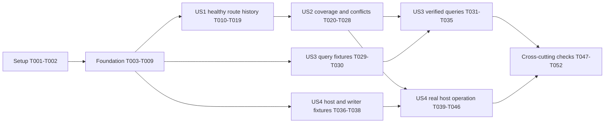

# Tasks: Hourly Route History

**Input**: `specs/057-hourly-route-history/` specification, plan, research, data model, contracts and quickstart  
**Branch**: `056-city-transit-type-insights`; stay on this branch and do not switch branches. Commit or push only when explicitly requested.  
**Status**: Core capture, schema, writer, runtime, and query work is implemented. Deterministic suites pass. Disposable PostgreSQL execution, remaining planned host/writer/fault-injection/lifecycle tests, migration-image build, load/production observation, and analyst acceptance remain pending; see validation.md.

**Tests**: Automated capture, clock, whole-hour retention/concurrency and query checks are explicitly required by the specification's testing section and source design. Add focused project-native tests before the corresponding behavior; confirm they detect the intended missing/incorrect behavior. Use owned disposable PostgreSQL only. Record skips and acceptance measurements honestly.

## Format and paths

Every task uses `- [ ] TNNN [P?] [USn?] description with repository-relative file paths`. `[P]` marks work in different files that can run together once stated prerequisites are complete. Story phases require `[US1]` through `[US4]`; setup/foundation/polish do not. No new projects/packages/endpoints are required. Existing files keep their contracts; names of new files are proposed by the plan.

## Phase 1: Setup

**Purpose**: Establish reproducible baseline and source-backed acceptance fixtures.

- [X] T001 Record current branch, relevant Worker/WebAPI baseline results, available EF tool setup, and explicitly provisioned disposable-test prerequisites in specs/057-hourly-route-history/validation.md; do not deploy, switch branches, or commit.
- [X] T002 Freeze expected alias/case/grouped-route, healthy-empty, weighted-average and DST reference inputs plus fingerprint bytes/hash in specs/057-hourly-route-history/contracts/observed-route-hour-statistics-v1.md, keeping source design and existing live semantics authoritative.

## Phase 2: Foundational (blocking prerequisites)

**Purpose**: Establish shared identities, payloads, limits and schema before story implementation. These tasks supply common safety contracts, without enabling production capture.

- [X] T003 [P] Add limits-only RouteHourHistoryOptions and immutable runtime mode/selected-city projection contracts in src/Server/ChefKnifeStudios.TransitJazz.Server.TransitDataWorker/Statistics/RouteHourHistoryOptions.cs using plan defaults/finite ceilings; expose no independent Enabled/DryRun/Cities/DisabledCities resource properties.
- [X] T004 [P] Add immutable canonical entries, alias resolution and deterministic length-prefixed fingerprint/cohort encoding in src/Server/ChefKnifeStudios.TransitJazz.Server.TransitDataWorker/Statistics/RouteHourCatalog.cs; use actual ordered geometry, ordinal keys, contributing static IDs and the T002 fixture.
- [X] T005 [P] Add aggregate-only immutable row/envelope DTOs, coverage/reason vocabulary, common UTC/numeric/cohort validation and immediate IRouteHourStatisticsSink contract in src/Server/ChefKnifeStudios.TransitJazz.Server.TransitDataWorker/Statistics/FinalizedRouteHourStatisticsBatch.cs; include all data-model fields without covered_minutes or identities.
- [X] T006 [P] Add CityRouteHourStatistic and explicit key/index/types/defaults/check mapping in src/Server/ChefKnifeStudios.TransitJazz.Server.Data/Models/CityRouteHourStatistic.cs and src/Server/ChefKnifeStudios.TransitJazz.Server.Data/Configurations/CityRouteHourStatisticConfiguration.cs, including ordinal identity, 512-byte keys and Complete/NoData consistency.
- [X] T007 Register the fourth statistics entity in src/Server/ChefKnifeStudios.TransitJazz.Server.Data/AppDbContext.cs, scaffold one schema-only CreateCityRouteHourStatistics migration under src/Server/ChefKnifeStudios.TransitJazz.Server.Data/Migrations/, update AppDbContextModelSnapshot.cs, and update only the entity-count expectation in src/Server/ChefKnifeStudios.TransitJazz.Server.WebAPI.Tests/Statistics/CityMinuteStatisticModelTests.cs; preserve prior assertions/schema.
- [X] T008 [P] Add clock/feed/publisher and canonical-catalog fixtures in src/Server/ChefKnifeStudios.TransitJazz.Server.TransitDataWorker.Tests/Statistics/RouteHourCaptureFixture.cs, including per-hook instrumentation fault injection without live-state mutation.
- [X] T009 [P] Add guarded opt-in disposable PostgreSQL helpers in src/Server/ChefKnifeStudios.TransitJazz.Server.WebAPI.Tests/Statistics/RouteHourStatisticsDatabaseFixture.cs using ROUTE_HOUR_HISTORY_DISPOSABLE_CONNECTION and an owned disposable-name check; never reuse legacy EnsureDeleted setup or operator connections.

**Checkpoint**: After T003-T009, keys/payloads/limits/schema and test fixtures are available. T007 depends on T006; T008 depends on T004/T005; T009 is independent once setup identifies a disposable strategy.

## Phase 3: User Story 1 - Compare route activity and soundscape opportunities (P1)

**Goal**: A healthy hour yields canonical active/inactive route history with accurate movement, processing and published counts.

**Independent Test**: Use deterministic live Worker/catalog/feed/publisher fixtures and the disposable store to capture a full healthy bracketed hour with active/inactive routes, then inspect the hourly query and reconcile counters to actual worker observations. Tests can compose runtime/sink dependencies directly before production registration is finished.

### Tests

- [X] T010 [P] [US1] Add canonical aliases/grouped shapes/city/key-case, activity feed-order deduplication and healthy-empty reference checks in src/Server/ChefKnifeStudios.TransitJazz.Server.TransitDataWorker.Tests/Statistics/RouteHourActivityTests.cs.
- [X] T011 [P] [US1] Add stationary/reverse/first-seen/source-time/missing/equal/older/synthetic-repeat/transfer/geometry and exact 2,000-meter movement checks in src/Server/ChefKnifeStudios.TransitJazz.Server.TransitDataWorker.Tests/Statistics/RouteHourMovementTests.cs.
- [X] T012 [P] [US1] Add actual moved/unchanged/stationary/stale processing, suppression, prepared-record and successful/no/failed publication reconciliation checks in src/Server/ChefKnifeStudios.TransitJazz.Server.TransitDataWorker.Tests/Statistics/RouteHourWorkerIntegrationTests.cs, asserting unchanged existing live results.
- [X] T013 [P] [US1] Add model/migration checks and initial whole-envelope insertion/identical-retry/later-command rollback tests in src/Server/ChefKnifeStudios.TransitJazz.Server.WebAPI.Tests/Statistics/RouteHourStatisticsStoreTests.cs and src/Server/ChefKnifeStudios.TransitJazz.Server.WebAPI.Tests/Statistics/RouteHourStatisticsMigrationTests.cs using T009.

### Implementation

- [X] T014 [US1] Build/publish canonical RouteHourCatalog with existing route indexes in src/Server/ChefKnifeStudios.TransitJazz.Server.TransitDataWorker/Worker.cs; carry it through RouteCatalogSnapshot, preserve aliases/live/category refresh behavior, and validate blank/oversized/ambiguous case-colliding geometry identities.
- [X] T015 [US1] Implement once-only cycle observations, activity representatives, content-based movement baselines/watermarks, exact counts and narrow safe instrumentation wrappers in src/Server/ChefKnifeStudios.TransitJazz.Server.TransitDataWorker/Statistics/RouteHourStatisticsCapture.cs; retain existing freshness/rounding/20-minute-pruning rules.
- [X] T016 [US1] Implement bounded current/boundary-pending UTC-hour state, healthy-zero route samples, exact distinct populations, basic outcome/boundary completeness and immutable sealing in src/Server/ChefKnifeStudios.TransitJazz.Server.TransitDataWorker/Statistics/RouteHourStatisticsAccumulator.cs; invalid/unknown evidence must never become Complete even before US2 fault extensions.
- [X] T017 [US1] Wire isolated begin/activity/snap/processing/suppression/detection/publication/outer-completion hooks into src/Server/ChefKnifeStudios.TransitJazz.Server.TransitDataWorker/Worker.cs; use one completion time and final catalog-content recheck, copy aggregate counts before recyclable lists expire, and preserve known publication on instrumentation failure.
- [X] T018 [US1] Implement parameterized fresh-context read-committed whole-city/hour persistence with separate advisory-lock then cohort lookup, single-transaction command chunks and immutable full-payload comparison/quarantine in src/Server/ChefKnifeStudios.TransitJazz.Server.Data/Statistics/CityRouteHourStatisticsStore.cs; never merge/overwrite/fill fragments.
- [ ] T019 [US1] Verify healthy hourly fields/known zeros/denominators and route/city reconciliation against specs/057-hourly-route-history/contracts/route-hour-insights.sql, recording US1 focused/disposable results and skips in specs/057-hourly-route-history/validation.md.

**Checkpoint**: US1 is independently demonstrable through composed fixtures/capture/store/query. Production enablement requires US2 coverage/loss invariants and US4 host/writer modes. US1 and US2 are both P1 and together form trustworthy route history.

## Phase 4: User Story 2 - Recognize collection gaps and uncertain history (P1)

**Goal**: Incomplete coverage, changed catalogs, resource loss, restarts and competing producers never supply false definitive hours.

**Independent Test**: Drive boundary/failure/cap/catalog cases and concurrent finalized cohorts, then inspect stored status, ordered reasons, null lost populations, Missing pairs and sticky whole-cohort quarantine.

### Tests

- [X] T020 [P] [US2] Add clock-driven predecessor/successor gaps, exact UTC boundaries, startup/shutdown, deadline while in flight, late completion, long pause, clock regression and idempotent flush checks in src/Server/ChefKnifeStudios.TransitJazz.Server.TransitDataWorker.Tests/Statistics/RouteHourCoverageTests.cs.
- [X] T021 [P] [US2] Add content-identical/changed/in-flight catalog refresh, union/first metadata, ambiguous geometry, per-cycle/hour/baseline caps and unavailable distinct denominator checks in src/Server/ChefKnifeStudios.TransitJazz.Server.TransitDataWorker.Tests/Statistics/RouteHourCatalogAndLimitTests.cs.
- [ ] T022 [P] [US2] Add source/processing/publication/NoData and throwing begin/record/commit/refresh/prune/sweep/flush instrumentation checks in src/Server/ChefKnifeStudios.TransitJazz.Server.TransitDataWorker.Tests/Statistics/RouteHourFailureIsolationTests.cs, proving live processing/publication remain unchanged.
- [ ] T023 [P] [US2] Add concurrent identical/different runs/definitions/payloads/route sets, lost commit acknowledgement, sticky quarantine and no restart-fragment merging checks in src/Server/ChefKnifeStudios.TransitJazz.Server.WebAPI.Tests/Statistics/RouteHourStatisticsDurabilityTests.cs, including post-lock lookup visibility.

### Implementation

- [X] T024 [US2] Complete ordered reason/state selection, catalog union/first metadata, sealed-window progress, startup/shutdown and deadline/gap evidence in src/Server/ChefKnifeStudios.TransitJazz.Server.TransitDataWorker/Statistics/RouteHourStatisticsAccumulator.cs; disclose intermediate Missing hours without replay or fabricated zeros.
- [X] T025 [US2] Enforce recording-time tracked-identity/route-membership bounds, content-only baseline invalidation, hour-loss/null-population behavior and next-window recovery in src/Server/ChefKnifeStudios.TransitJazz.Server.TransitDataWorker/Statistics/RouteHourStatisticsCapture.cs; drop an unrepresentable entire cohort and report safely.
- [X] T026 [US2] Add independent TimeProvider sweep <=15 seconds and once-only shutdown flush in src/Server/ChefKnifeStudios.TransitJazz.Server.TransitDataWorker/Statistics/RouteHourCaptureLifecycleService.cs, freezing under the state lock and validating/admitting/reporting outside it.
- [X] T027 [US2] Complete bounded transaction-local lock/statement timeouts, cancellation/rollback and full-city/hour monotone quarantine behavior in src/Server/ChefKnifeStudios.TransitJazz.Server.Data/Statistics/CityRouteHourStatisticsStore.cs; compare canonical timestamps/numerics/reasons exactly and preserve original counters.
- [ ] T028 [US2] Validate Partial/NoData/Missing/Conflict and no-false-complete reference cases against specs/057-hourly-route-history/contracts/route-hour-insights.sql and record US2 coverage/durability evidence in specs/057-hourly-route-history/validation.md.

**Checkpoint**: Capture and retention remain trustworthy under defined loss and conflict scenarios. Effective query coverage excludes every affected definitive measure.

## Phase 5: User Story 3 - Compare periods and local hours correctly (P2)

**Goal**: Internal queries return accurate weighted/local-hour analysis with coverage, historical identities, definitions, units and denominator evidence.

**Independent Test**: Seed owned disposable reference cohorts and execute prepared SQL for unequal samples, no contributors, removed/absent routes, unsupported stored definitions, partial request bounds and DST; compare returned arrays to independently calculated values.

### Tests

- [ ] T029 [P] [US3] Add PostgreSQL hourly/coverage/weighted/empty/explicit-versus-all-route/historical-key/definition/cadence/boundary fixtures in src/Server/ChefKnifeStudios.TransitJazz.Server.WebAPI.Tests/Statistics/RouteHourStatisticsQueryTests.cs, including entirely missing all-route city windows.
- [X] T030 [P] [US3] Add UTC/local-date/hour/offset, repeated/skipped DST hour and typical-hour denominator fixtures in src/Server/ChefKnifeStudios.TransitJazz.Server.WebAPI.Tests/Statistics/RouteHourStatisticsLocalTimeTests.cs without prorating or synthesizing rows.

### Implementation

- [X] T031 [US3] Copy the feature SQL into test output using src/Server/ChefKnifeStudios.TransitJazz.Server.WebAPI.Tests/ChefKnifeStudios.TransitJazz.Server.WebAPI.Tests.csproj and bind all six parameters through T009 fixtures; keep prior category contracts included.
- [ ] T032 [US3] Execute/refine specs/057-hourly-route-history/contracts/route-hour-insights.sql to return same-snapshot city/route coverage, hourly diagnostics, definition/cadence partitions and numeric weighted periods with null means for zero denominators; preserve full-contained-hour rules, historical membership uncertainty and fingerprints.
- [ ] T033 [US3] Verify local-hour recipe fields/grouping and safe city configured IANA-zone validation in specs/057-hourly-route-history/contracts/observed-route-hour-statistics-v1.md and specs/057-hourly-route-history/contracts/route-hour-insights.sql; keep UTC identity and offsets and count repeated UTC hours separately.
- [X] T034 [US3] Finalize parameter/result/units/known-zero-versus-missing and movement/opportunity interpretation examples in specs/057-hourly-route-history/contracts/observed-route-hour-statistics-v1.md and document validated internal query usage in specs/057-hourly-route-history/quickstart.md; create no public endpoint.
- [ ] T035 [US3] Record actual SQL reference execution, snapshot/quarantine behavior and weighted/DST/historical-route results in specs/057-hourly-route-history/validation.md, distinguishing pending or skipped database checks.

**Checkpoint**: Query recipes and definitions pass real reference checks and preserve coverage rather than hiding incomplete rows.

## Phase 6: User Story 4 - Operate collection with existing history controls (P2)

**Goal**: Existing collection scope/modes operate a bounded asynchronous writer and lifecycle with safe diagnostics and unchanged live cadence.

**Independent Test**: Build the host under disabled/dry-run/persistence and explicit/empty city scopes with both category-flag values; inject storage stalls/faults and verify no disabled work, zero dry-run writes, same selected cities, immediate admission, finite retries/drain and stop-before-writer order.

### Tests

- [ ] T036 [P] [US4] Add finite limit validation, existing mode precedence, resolved city fallback/scope, DB/sink prerequisites and unrelated category-enable checks in src/Server/ChefKnifeStudios.TransitJazz.Server.WebAPI.Tests/Statistics/RouteHourCaptureHostRegistrationTests.cs.
- [ ] T037 [P] [US4] Add full-channel immediate rejection, immutable whole-envelope retry/timeout/classification, dry-run no-store calls, safe summaries and bounded shutdown checks in src/Server/ChefKnifeStudios.TransitJazz.Server.WebAPI.Tests/Statistics/RouteHourStatisticsWriterTests.cs.
- [ ] T038 [P] [US4] Add Worker/lifecycle/writer stop-order and idempotent duplicate flush checks in src/Server/ChefKnifeStudios.TransitJazz.Server.TransitDataWorker.Tests/Statistics/RouteHourCaptureLifecycleTests.cs and src/Server/ChefKnifeStudios.TransitJazz.Server.WebAPI.Tests/Statistics/RouteHourCaptureHostRegistrationTests.cs; verify capture can flush before admission closes and no continuation runs storage on the producer.

### Implementation

- [X] T039 [US4] Bind nested limits and validate them without adding mode/city controls in src/Server/ChefKnifeStudios.TransitJazz.Server.WebAPI/Statistics/HistoricalStatisticsOptions.cs; project the already resolved HistoricalStatistics selection into Worker runtime mode and preserve existing collector credentials/grace/overlap behavior.
- [X] T040 [US4] Add bounded writer, immutable DTO-to-Data adapter, no-op/validated dry-run sinks, immediate TryWrite admission and aggregate-only outcome reports in src/Server/ChefKnifeStudios.TransitJazz.Server.WebAPI/Statistics/RouteHourStatisticsWriter.cs; use Wait mode, one reader, no synchronous continuations and whole-envelope writes.
- [X] T041 [US4] Add total attempt cancellation/command/lock budgets, up-to-three exact retries with one/two-second delays and separate bounded shutdown drain in src/Server/ChefKnifeStudios.TransitJazz.Server.WebAPI/Statistics/RouteHourStatisticsWriter.cs; dispose failed attempts before retry, report rejected/exhausted/undrained envelopes and never wait on the worker.
- [X] T042 [US4] Register correct disabled/dry-run/persistence sinks, writer-before-capture/lifecycle/Worker and selected-city/time-zone validation in src/Server/ChefKnifeStudios.TransitJazz.Server.WebAPI/Statistics/RouteHourCaptureServiceCollectionExtensions.cs and src/Server/ChefKnifeStudios.TransitJazz.Server.WebAPI/Program.cs; preserve enabled-history DB validation and category independence.
- [X] T043 [US4] Validate intentional standalone route modes/real-sink prerequisites in src/Server/ChefKnifeStudios.TransitJazz.Server.TransitDataWorker/Program.cs and wire safe prune/refresh/idempotent flush into src/Server/ChefKnifeStudios.TransitJazz.Server.TransitDataWorker/Worker.cs without changing live/category contracts.
- [X] T044 [US4] Add documented limits-only defaults to src/Server/ChefKnifeStudios.TransitJazz.Server.WebAPI/appsettings.json while preserving HistoricalStatistics.Enabled=false and DryRun=true; if deployment exposure is needed, extend bicep/main.bicep and bicep/modules/containerApp.bicep only for resource tunables and regenerate bicep/main.json using existing enable/dry-run parameters.
- [X] T045 [US4] Extend .github/workflows/server.yml with a narrow schema-only guard for the new migration and existing disabled/dry-run/config regression checks; preserve older category migration guards, migration-image build and schema-first operator gating.
- [ ] T046 [US4] Record validated mode/scope/writer/lifecycle/summary behavior and selected-city catalog/key/population/timestamp/cadence preflight in specs/057-hourly-route-history/validation.md; update operator mode guidance in specs/057-hourly-route-history/quickstart.md without adding a one-city pilot requirement.

**Checkpoint**: All four stories can run through the real host under existing controls. Live processing remains independent of retention and all admission/loss/retry outcomes are bounded and visible.

## Phase 7: Polish and cross-cutting verification

**Purpose**: Finish reviewable schema/build/regression evidence and operator acceptance; do not claim production checks before they occur.

- [X] T047 Run relevant Worker/WebAPI focused and existing city/category regressions using the commands in specs/057-hourly-route-history/quickstart.md and record results/skips in specs/057-hourly-route-history/validation.md; verify the fourth-entity model and old live/source contracts.
- [ ] T048 Build the existing server and Data migration artifacts using src/Server/ChefKnifeStudios.TransitJazz.Server.Data/Dockerfile and review the generated idempotent script/new schema-only migration; record the exact artifact/schema and build evidence in specs/057-hourly-route-history/validation.md without applying production changes.
- [ ] T049 Measure actual selected-city cardinalities, capture memory, queue occupancy, write latency and row/index/storage growth plus matched-load enabled/disabled p95 overhead <=5%, recording bounded settings and evidence in specs/057-hourly-route-history/validation.md.
- [ ] T050 Prepare the reviewed schema-before-code operator handoff in specs/057-hourly-route-history/quickstart.md through the existing bicep/README.md deployment process; when that process authorizes rollout, apply/verify schema before code and observe the existing selected cities for 24 healthy hours with >=99% complete eligible route-hours after startup fragments, zero normal queue/write loss/conflicts and <=15-second expired-window finalization, recording pending/completed evidence in specs/057-hourly-route-history/validation.md.
- [ ] T051 Verify at least four of five representative analysts correctly interpret known zeros/gaps, route-vehicle-hour movement versus trips and published opportunities versus audible notes using specs/057-hourly-route-history/contracts/observed-route-hour-statistics-v1.md; record handoff feedback in specs/057-hourly-route-history/validation.md without contacting people unless instructed.
- [X] T052 Reconcile completed requirements/acceptance evidence and retained-start/growth/future-retention notes in specs/057-hourly-route-history/validation.md and specs/057-hourly-route-history/quickstart.md, review the final diff, retain the current branch, and commit/push only when explicitly requested.

## Dependencies and execution order

- Setup precedes foundation. T003-T006 can proceed together; T007 follows T006. T008 follows catalog/DTO contracts. No story implementation starts before shared contracts/schema/fixtures are ready.
- US1 tests T010-T013 use distinct files. T014 supplies canonical routing to T015/T016; T017 follows capture/accumulator; T018 can proceed after Data/DTO foundations without editing Worker. T019 follows capture, hooks and store. Do not enable production at this checkpoint.
- US2 tests T020-T023 are independent after foundation/US1 interfaces. T024-T026 share state/lifecycle contracts and are integrated in order; T027 extends T018; T028 verifies the full failure slice. US2 requires US1 measurements, but its fault cases are independently testable with reference cycles/envelopes.
- US3 fixtures can be authored after foundation and seeded without a live worker; real recipe verification requires implemented store/quarantine and T031 SQL copying. T032-T034 edit the same SQL/docs and run sequentially. T035 follows them. No UI/API depends on US3.
- US4 fixtures can be authored after foundation; implementation follows capture/store interfaces. T039 precedes host binding; T040 then T041 precede T042; lifecycle/worker changes are serialized with any US2 Worker changes. T043-T046 verify the real runtime. US3 and US4 implementation can run in different files after US2, except shared validation.md/quickstart.md updates must be serialized.
- Final checks follow all story implementations. T049 measures local/controlled workloads; T050 production work remains subject to the existing operator deployment process. T051 requires access to analyst feedback and never authorizes unsolicited messages. Unavailable operational evidence stays pending, not falsely checked complete.

## Parallel execution examples

| Slice | Tasks that can run together | Prerequisite / separation |
| --- | --- | --- |
| Foundation | T003, T004, T005, T006 | Setup complete; distinct limits/catalog/DTO/Data files |
| US1 | T010, T011, T012, T013 | Foundation fixtures/contracts ready; distinct test files |
| US2 | T020, T021, T022, T023 | Existing capture/store contracts; distinct failure/clock/catalog/durability files |
| US3 | T029, T030 | Disposable query fixture ready; distinct SQL/reference and local-time tests |
| US4 | T036, T037, T038 | Runtime/sink contracts ready; distinct host/writer/lifecycle tests |

`[P]` is not permission to run before prerequisites or edit shared files concurrently. Implementation tasks touching Worker, capture, accumulator, SQL, host registration, quickstart or validation are serialized as documented.

## Requirement coverage

| Requirements / outcomes | Primary tasks |
| --- | --- |
| FR-001-FR-004 identity/catalog | T004, T010, T014, T021, T024-T025 |
| FR-005-FR-012 measures/freshness/commit; SC-001 | T005, T010-T012, T015-T019 |
| FR-013-FR-016 coverage/boundaries; SC-002/SC-008 | T005, T016, T020-T022, T024-T026, T028 |
| FR-017/FR-029 atomicity/conflict/invariants; SC-006 | T005-T007, T013, T018, T023, T027 |
| FR-018-FR-022 isolation/limits/modes/logging; SC-004/SC-008 | T003, T012, T017, T022, T025, T036-T046, T049 |
| FR-023-FR-028 queries/units/local time; SC-005 | T019, T028-T035 |
| FR-030 future-only/schema/retention | T007, T044-T045, T048, T050, T052 |
| SC-003 24-hour quality | T049-T050 |
| SC-007 analyst comprehension | T034, T051 |

## Implementation strategy

The smallest useful demonstration is US1 capture/store/hourly results under controlled fixtures. The first deployable MVP is US1 + US2 + US4, because coverage, atomicity and existing runtime controls are essential to trustworthy live collection; basic hourly/coverage query support already exists in US1/US2. US3 adds the full verified period/local-hour analyst experience. Complete shared safety foundations first, then deliver/test each story increment. Do not relax coverage to accelerate deployment or claim pending measurements as passed.

No task requires creating a commit. New migrations, code, tests and generated documentation remain available for the user to review and commit themselves.
